# Tutorial

The purpose for NetBIDshiny: 

**further analyze and visualize the results for drivers**.

We choose the same demo dataset from GEO database: [GSE116028](https://www.ncbi.nlm.nih.gov/geo/query/acc.cgi?acc=GSE116028). 

This dataset contains microarray data for 13 adult medulloblastoma (MB) samples. 
Three subgroups of adult MB were identified by distinct expression profiles, clinical features, pathological features, and prognosis, including 3 SHH, 4 WNT, and 6 Group4.
From them, Group4 tumors in adult had significantly worse progression-free and overall survival compared with tumors of the other molecular subtypes. 
Here, we want to **find potential hidden drivers in Group4 compared with the other subtypes by using NetBID2**, for which may be related with the specific clinical feature for Group4 MB.


----------
## Quick Navigation for this page

- [Before start: Introduction to the server's interface & pre-request](#before-start-introduction-to-the-servers-interface--pre-request)

- [Upload the RData dataset](#upload-the-rdata-dataset)

- [Plot part](#plot-part)

  - [VOLCANO_PLOT: Draw the Volcano plot to get the top differentiated expression/activity driver list](#volcano_plot-draw-the-volcano-plot-to-get-the-top-differentiated-expressionactivity-driver-list)

  - [NETBID_PLOT: Draw the NetBID plot to get the detailed statistics of the top differentiated expression/activity driver list](#netbid_plot-draw-the-netbid-plot-to-get-the-detailed-statistics-of-the-top-differentiated-expressionactivity-driver-list)

  - [GSEA_PLOT: Draw the GSEA plot to get the detailed information of the top differentiated activity driver list](#gsea_plot-draw-the-gsea-plot-to-get-the-detailed-information-of-the-top-differentiated-activity-driver-list)

  - [HEATMAP: Draw the Heatmap to get the expression/activity pattern for the top driver list Vs. all samples](#heatmap-draw-the-heatmap-to-get-the-expressionactivity-pattern-for-the-top-driver-list-vs-all-samples)

  - [FUNCTION_ENRICH_PLOT: Draw the Function Enrichment plot to get the function annotation for the top driver list](#function_enrich_plot-draw-the-function-enrichment-plot-to-get-the-function-annotation-for-the-top-driver-list)

  - [BUBBLE_PLOT: Draw the Bubble plot to get the function annotation for the top driver list and their target genes](#bubble_plot-draw-the-bubble-plot-to-get-the-function-annotation-for-the-top-driver-list-and-their-target-genes)

  - [TARGET_NET: Draw the Target Network plot to draw the sub-network structure for one selected driver](#target_net-draw-the-target-network-plot-to-draw-the-sub-network-structure-for-one-selected-driver)

  - [CATEGORY_BOXPLOT: Draw the Category box plot to get the expression/activity value distribution in each group of samples](#category_boxplot-draw-the-category-box-plot-to-get-the-expressionactivity-value-distribution-in-each-group-of-samples)

---------

## Before start: Introduction to the server's interface & pre-request

In the "Driver estimation" part of NetBID2 analysis, the final step is to generate a master table. If user strictly follow the suggested pipeline in NetBID2 analysis, and save an RData file by using `NetBID.saveRData(analysis.par=analysis.par,step='ms-tab')`, he will get an RData file under the `analysis.par$out.dir.DATA` directory with name as `analysis.par.Step.ms-tab.RData`. The RData file will contains one complicated list object `analysis.par` with following components:

- **main.dir**, the main directory for the project, required for NetBIDshiny. 
- **project.name**, the project name, required for NetBIDshiny. 
- **merge.network**, a list with three components (target_list,igraph_obj,target_net) which contains detailed network structure for the NetBID analysis, required for NetBIDshiny.
- **cal.eset**, a ExpressionSet class object for the expression value of the analysis dataset, required for NetBIDshiny.
- **merge.ac.eset**, a ExpressionSet class object for the activity value of the analysis dataset, required for NetBIDshiny.
- **final_ms_tab**, a data frame containing detailed results for all tested drivers, required for NetBIDshiny.
- **transfer_tab**, a data frame for ID conversion, required but not necessary to run NetBIDshiny, if not included in the RData, it will automatically generate it in the first loading of the data. 
- out.dir out.dir.QC out.dir.DATA out.dir.PLOT, the directory structure for the NetBID project, not required for NetBIDshiny. 
- DE DA, detailed differentiated expression (DE)/activity (DA) statistics, not required for NetBIDshiny.

Check the following diagram:

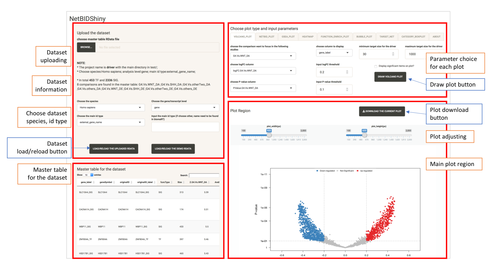

The interface is consisted of four parts:

- Topleft, mainly for manipulating the data sets; User could browser the dataset in the local file system, choose the species, analysis level, main id type for the selected dataset and upload the dataset. The demo dataset could be used for getting familiar with the app.

- Bottomleft, mainly for browsering the master table in this project. User could search and visualize the driver's detailed information.

- Topright, mainly for selecting the plot type and the choice of parameters for each plot.

- Bottomright, mainly for the plot region, including the basic adjusting bar and one figure download button. User could choose to directly save the plot by right click on the plot and save it into the png format or use the download button, it will save the current figure into a pdf file.

The name for the plot tabs:

- **VOLCANO_PLOT**, the volcano plot to get the top differentiated expression/activity driver list, will call `draw.volcanoPlot()` in NetBID2.
- **NETBID_PLOT**, the NETBID plot to get the statistics of top differentiated expression/activity driver list, will call `draw.NetBID()` in NetBID2.
- **GSEA_PLOT**, the GSEA plot to get the detailed statistics of the top differentiated expression/activity driver list, will call `draw.GSEA.NetBID()` in NetBID2.
- **HEATMAP**, the Heatmap to get the expression/activity pattern for the top driver list Vs. all samples, will call `draw.volcanoPlot()` in NetBID2.
- **FUNCTION_ENRICH_PLOT**, the Function Enrichment plot to get the function annotation for the top driver list, will call `draw.funcEnrich.cluster()` in NetBID2.
- **BUBBLE_PLOT**, the Bubble plot to get the function annotation for the top driver list and their target genes, will call `draw.bubblePlot()` in NetBID2.
- **TARGET_NET** , the Target Network plot to draw the sub-network structure for one selected driver, will call `draw.targetNet()` and `draw.targetNet.TWO()` in NetBID2.
- **CATEGORY_PLOT**, the Category box plot to get the expression/activity value distribution in each group of samples, will call `draw.categoryValue()` in NetBID2.

## Upload the RData dataset 

The first step is to upload the RData. 

User could click the **BROWSE** button and select the RData file stored locally. 
After that, choose:

- the species name in the select list (currently only 11 species is allowed due to the MSigDB annotation limitation). 
- the gene/transcript level, this is the level for the driver main ID type.
- the main id type, user could select the matched main ID type for the driver (the list contains 10 most common ID type). If it is not included in the list, user could manually enter it in the textbox in the right. For the full list of allowed id type, user could follow the instruction of [biomaRt](https://www.bioconductor.org/packages/devel/bioc/vignettes/biomaRt/inst/doc/biomaRt.html) or try the following locally:

```r
ensembl <- useMart("ensembl", dataset="hsapiens_gene_ensembl")
listAttributes(ensembl)
```
Click the **LOAD/RELOAD THE UPLOADED RDATA** button and wait for data uploading. Here, for demo, user could directly click **LOAD/RELOAD THE DEMO RDATA**. 
Once finished, user will see the following interface (the browser bar will not be shown if choose the demo dataset):

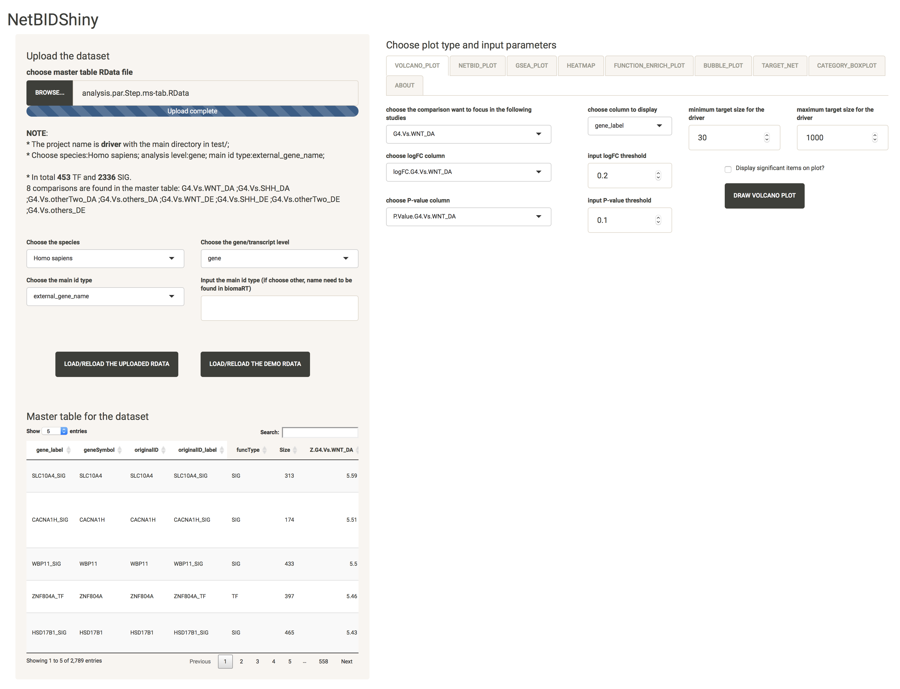

The master table and the NOTE for the dataset will be displayed and the **VOLCANO_PLOT**,**TARGET_NET**, **CATEGORY_PLOT** tabs are active to use.  

The NOTE message will display the project name, main directory, the species, analysis level, main id type, the number of TF (transcription factors) and SIG (signalling factors) and all comparisons in the master table. If some choice is wrong, user could modify the selection and reclick the **LOAD/RELOAD THE UPLOADED RDATA** button. 

**NOTE**: It will take about 3~4 seconds for uploading the demo dataset. 
If the original dataset is very large, for example the RData size is about 120 MB,  it will take about 10~15 seconds to upload the dataset if the original RData contains the ID transfer table. Otherwise, it will take longer for acquiring it from bioMart website (must with internet connection, about 10~20 seconds by testing). 

### Step 2: Navigate the master table for the dataset

The bottomleft of the interface displays the master table for the dataset. User could search the whole dataset by keywords and sort each column by clicking the column names. 
The first four columns are freezed as the `gene_label` is the human readable column for each driver, with `originalID_label` is the driver's name in original ID type. `geneSymbol` is the column for gene names in symbol with `originalID` is the original gene ID.


## Plot part

### VOLCANO_PLOT: Draw the Volcano plot to get the top differentiated expression/activity driver list

Volcano plot is the only one necessary plot user need to draw in NetBIDshiny app, if not, **NETBID_PLOT**, **GSEA_PLOT**, **HEATMAP**, **FUNCTION_ENRICH_PLOT**, **BUBBLE_PLOT** will not be active for use (The warning message will be: Please plot volcano plot first in order to choose the targeted comparison !). As in one NetBID project, multiple comparisons could be included for analysis. Those plots will use the top driver list for display that need user pre-defined comparison as the sorting criteria. 

Here, we select `G4.Vs.others_DA` as the comparison want to focus in the following studies, better to choose the logFC column and P-value column correspondingly (if not, it will automatically change to the column related to the comparison) change the logFC threshold to 0.3 and P-value threshold to 1e-8, select the `Display significant items on plot?`, the interface will be:

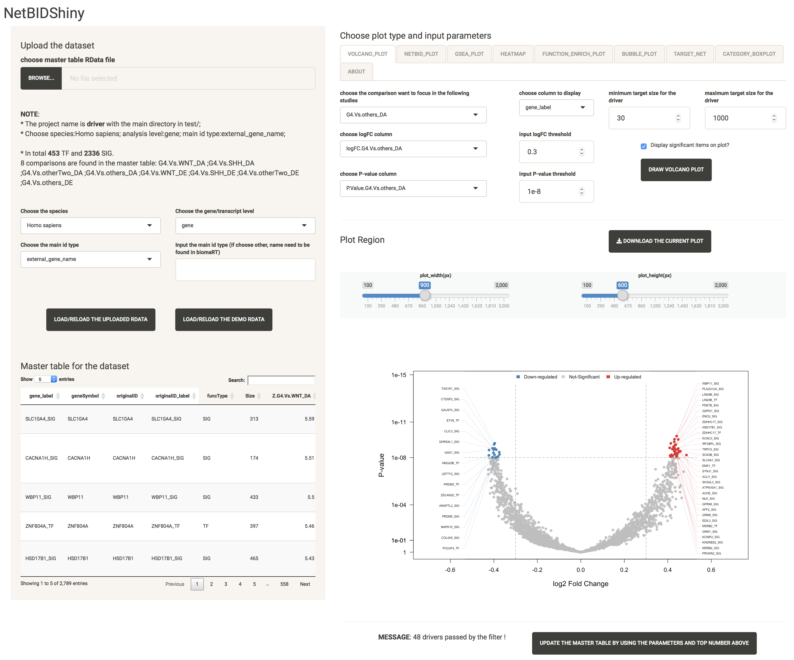

**NOTE**: user could choose to save the figure by right click and save or click the **DOWNLOAD THE CURRENT PLOT** button and the plot will saved into a pdf file (**the following screen capture plots include the interface for the server and the downloaded pdf file**):

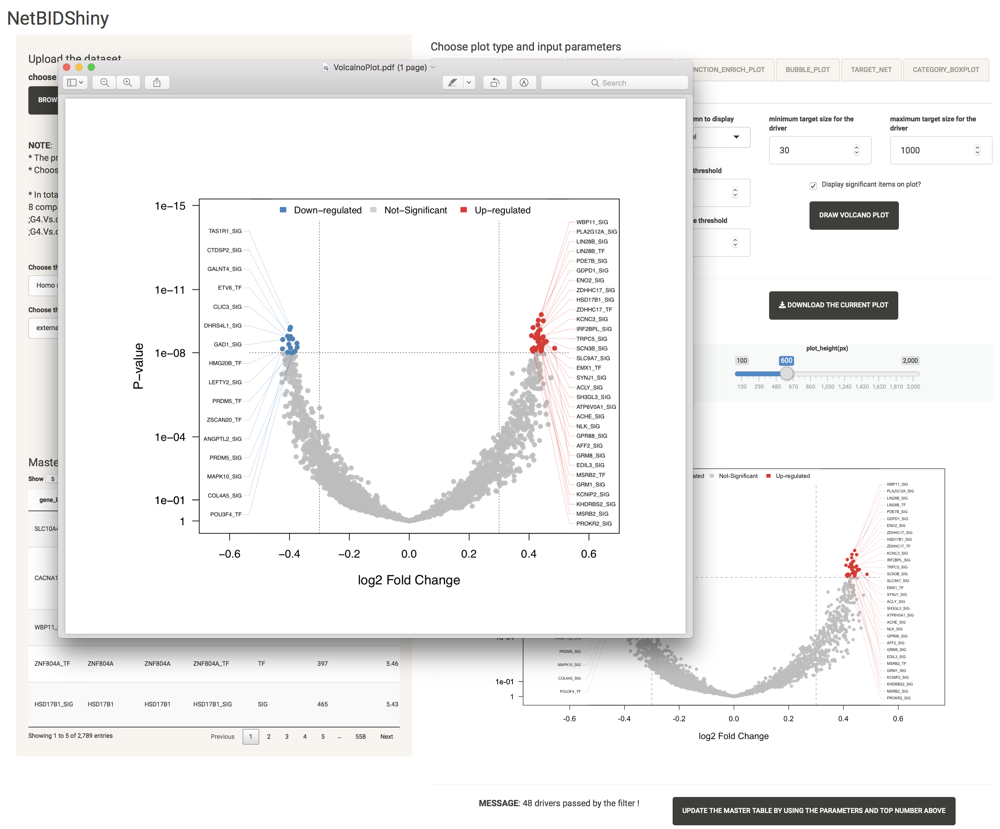

In the bottom, the message indicates that 48 drivers passed by the filter. User could try to further modify the parameters to get the top driver list. Once decided, user could choose to click **UPDATE THE MASTER TABLE BY USING THE PARAMETERS AND TOP NUMBER ABOVE**, and the interfact will be:

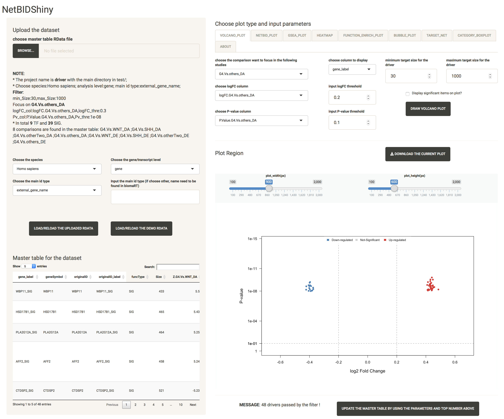

Now, the note message will record the parameters used for filteration and the master table only contains 48 drivers passed the filter. User could click on the **LOAD/RELOAD THE UPLOADED RDATA** to recover into the original full dataset. 

**NOTE**: if user only want the Z-statistics as the criteria to get the top driver list, it is not necessary to update the master table. When user click the **UPDATE THE MASTER TABLE BY USING THE PARAMETERS AND TOP NUMBER ABOVE** button, he will need to re-do the valcano plot step to define the main comparison. 

### NETBID_PLOT: Draw the NetBID plot to get the detailed statistics of the top differentiated expression/activity driver list

Check multiple comparisons for DA and DE to display, and the final plot will be ordered by the focusing comparison (here G4.Vs. others_DA). The detailed display statistics could be chosen from "P.Value" and "logFC" for DE and DA independently. 
Save or download the plot:

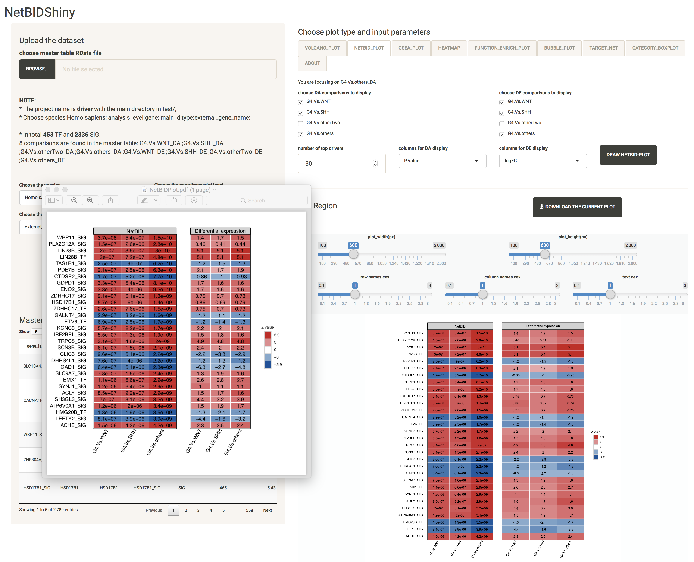

### GSEA_PLOT: Draw the GSEA plot to get the detailed information of the top differentiated activity driver list

GSEA plot is another way to display the top driver list. The option is the same to call `draw.NetBID.GSEA()` function in NetBID2. User could check the manual for detailed description. Try the following options:


Here, user could choose to only display the up or down-regulated drivers from the `choose the top strategy for selection`. 

### HEATMAP: Draw the Heatmap to get the expression/activity pattern for the top driver list Vs. all samples

Heatmap is also for the top driver visualization, it is focused on expression/activity pattern across all samples with sample category shown:

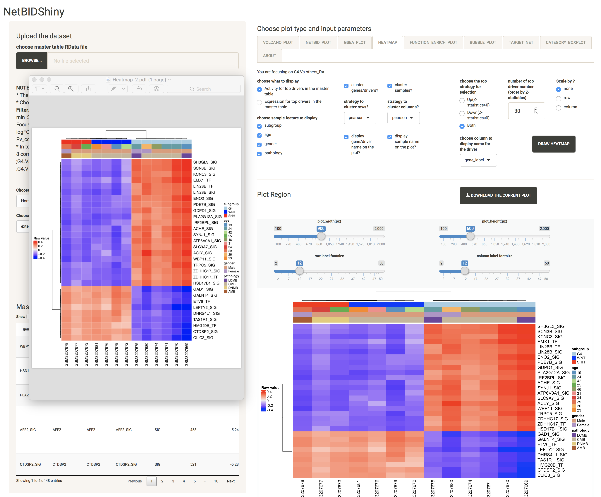

### FUNCTION_ENRICH_PLOT: Draw the Function Enrichment plot to get the function annotation for the top driver list

This plot is the functional analysis for the top drivers based on MSigDB annotation. User could choose multiple categories of gene sets and related statistics for calculation. If the main category is selected, no matter what is the selection condition for the sub-category, all gene sets in the main category will be used. For example, if user choose the 'C5:GO' category, all 'BP', 'MF', 'CC' will be used. 

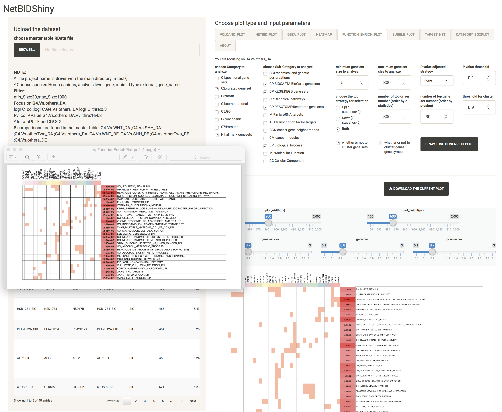

### BUBBLE_PLOT: Draw the Bubble plot to get the function annotation for the top driver list and their target genes

This plot is the functional analysis for the target genes of the top drivers based on MSigDB annotation and will take some time in calculation (about several seconds). This plot will be very large size to visualize and strongly suggest user to download the figure:

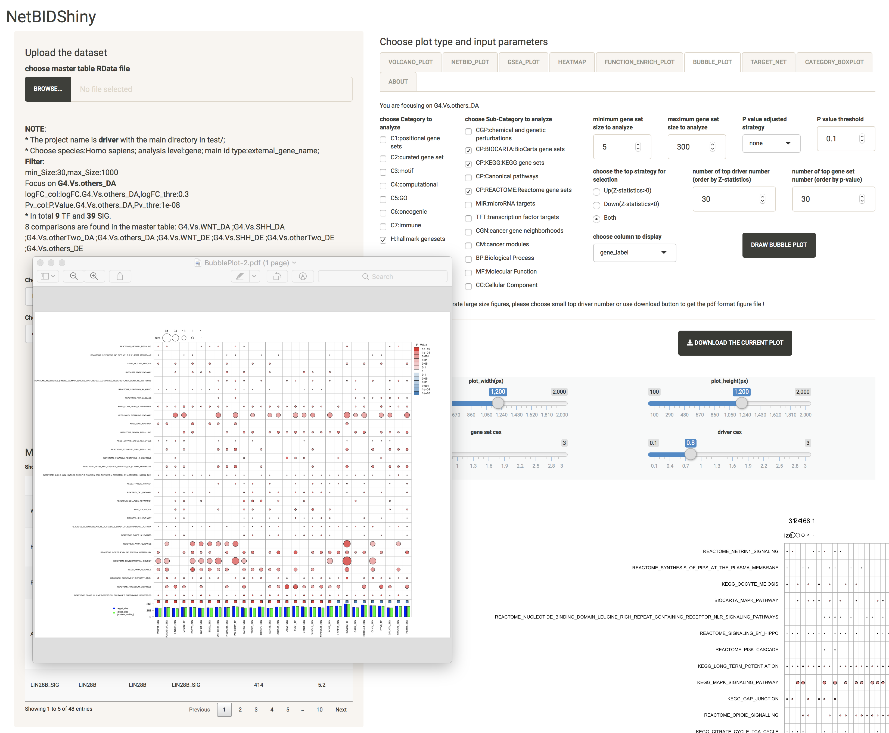

### TARGET_NET: Draw the Target Network plot to draw the sub-network structure for one selected driver

This plot is to visualize the sub-network structure for the selected driver or two drivers. User could try different target cex, number of layer to find a better visualization options:

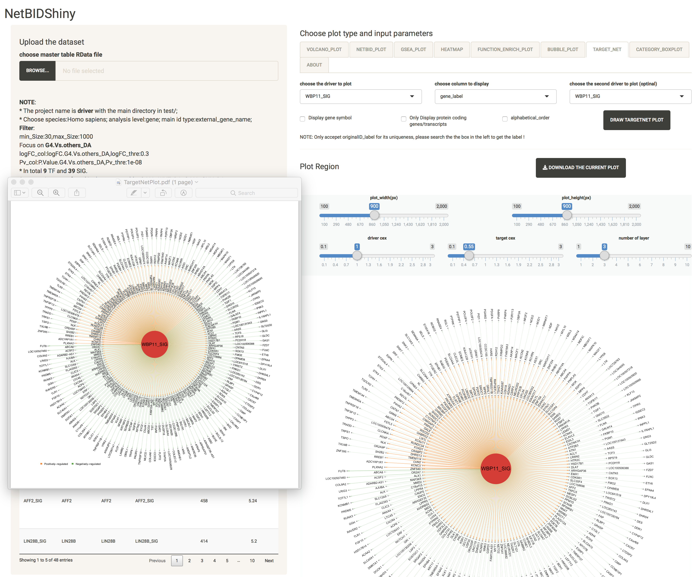

If the second driver is not the same as the first one, it will generate two driver interaction plot:


### CATEGORY_BOXPLOT: Draw the Category box plot to get the expression/activity value distribution in each group of samples

This plot is the box plot of activity/expression value across different category of samples, user could choose multiple categories at the same time:

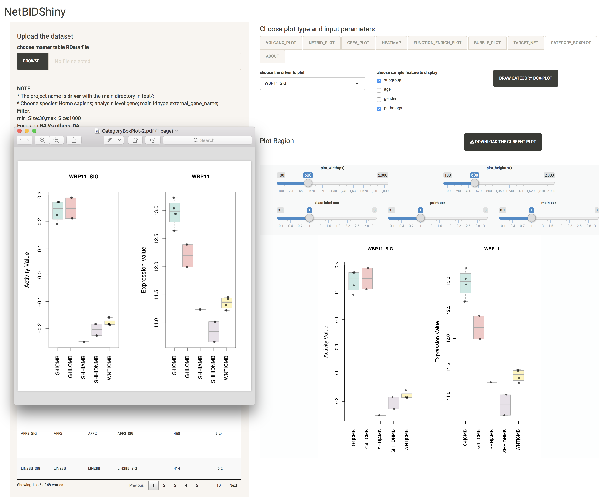


-------

