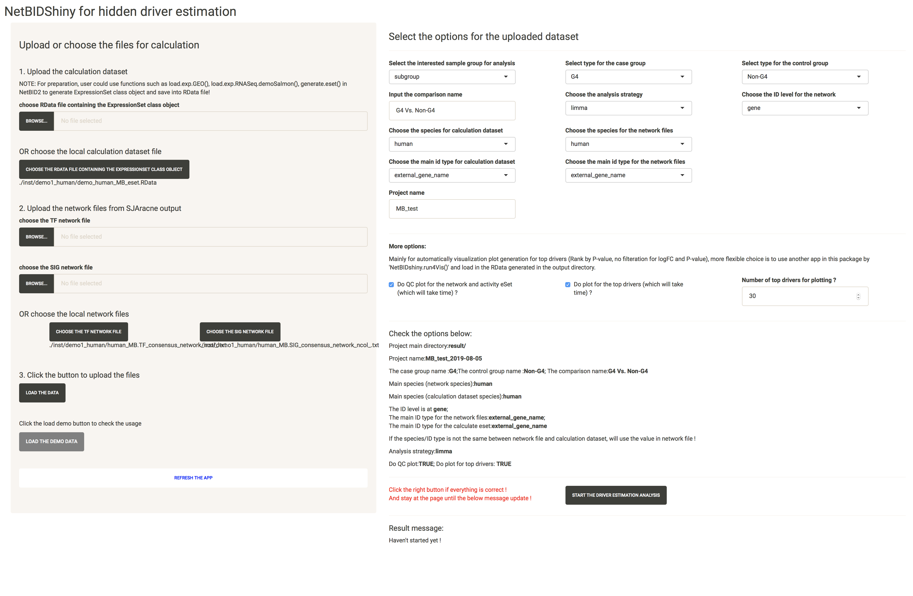

# Tutorial for Hidden driver (master regulator) estimation

The purpose of NetBIDshiny: 

**provide an interactive online tool for hidden driver analysis and automatically output plots for top drivers**.

We choose:

1. the human MB (medulloblastoma) demo dataset from GEO database as in NetBID2: [GSE116028](https://www.ncbi.nlm.nih.gov/geo/query/acc.cgi?acc=GSE116028), with network files generated by using the same dataset.

2. the mouse BPD (bronchopulmonary dysplasia) demo dataset from GEO database [GSE25286](https://www.ncbi.nlm.nih.gov/geo/query/acc.cgi?acc=GSE25286), with network files generated by using normal lung tissue from [GTEx](https://gtexportal.org/home/) (human).

----------
## Quick Navigation

- [Introduction to User Interface of NetBIDshiny](#introduction-to-user-interface-of-netbidshiny)

- [Upload the eset Rdata and network data](#upload-the-eset-rdata-and-network-data)

- [Select the options and start an analysis](#select-the-options-and-start-an-analysis)

- [Quick demo for the mouse dataset](#quick-demo-for-the-mouse-dataset)

- [Q & A: How to prepare eSet class object RData file ?](#q--a-how-to-prepare-eset-class-object-rdata-file-)

- [Q & A: How to use self-defined network files ?](#q--a-how-to-use-self-defined-network-files-)

- [Q & A: How to use if only has TF network without SIG network ?](#q--a-how-to-use-if-only-has-tf-network-without-sig-network-)

- [Q & A: How to deploy the application by having pre-generated network files or calculation dataset ?](#q--a-how-to-deploy-the-application-by-having-pre-generated-network-files-or-calculation-dataset-)

---------

Start the app, here we could choose the settle down the project main directory (if not set here, user could choose the output directory in the application):

```r
NetBIDshiny.run4MR(project_main_dir='result/')
```

## Introduction to User Interface of NetBIDshiny

The following screenshot is the user interface of NetBIDshiny,


**The user interface consists of 2 parts:**

- Left panel is designed for uploading dataset, including the calculation dataset and two network files generated by SJAracne. 

- Right panel is for the options of the uploaded dataset, and start an automatically hidden driver analysis.

-------

## Upload the eset Rdata and network data

We will use the human dataset in NetBIDshiny package as a demo. User could directly click the "LOAD THE DEMO DATA" button the skip this step and check the next part usage.

For the calculation dataset, user could click the "BROWSE" button to upload the RData file or click the "CHOOSE THE RDATA FILE CONTAINING THE EXPRESSIONSET CLASS OBJECT" button to select the file in the local directory. 

For the two network files, similarly, user could choose to upload or choose from the local directory (this is essential if user want to deploy the app in a local lan environment, which could share network files by calculating or collecting them in advance).


## Select the options and start an analysis

Click the "LOAD THE DATA" button, and follow the order of the box to select the options one by one and input the project name.

After all required options fixed, the page will be like this:



Click the "START THE DRIVER ESTIMATION ANALYSIS", wait (about 1~2 mins) until the Result message update like this:


If check the "Do plot for the top drivers" and the plot for top drivers will also be generated, which will take more time (about 1 mins).

If user input the `project_main_dir` in running the application, user need to click to download the zipped result file; otherwise, user need to select the output directory in previous step and need to follow the instructions on the page to find the output files. 

The result files will be structured like this:


A README.txt file is generated in the output directory to record the options in this analysis.

The DATA/ directory contains the result dataset, the final RData file including network structure, calculation dataset, inferred activity, differentiated statistics and final master table for all tested drivers. The excel file is the formatted result file for all drivers. 


The QC/ directory contains QC plots (if check the `Do QC plot for the network and activity eset`)


The PLOT/ directory contains plots for top drivers (if check the `Do plot for the top drivers`)


## Quick demo for the mouse dataset

We could input the mouse dataset but select human network files. In this condition, NetBID2 will automatically do ID transfer for the input mouse dataset and the final output will be at the human ID level. 

User could try the demo dataset in NetBIDshiny package:


## Q & A: How to prepare eSet class object RData file ?

NetBID2 has provided lots of functions to assist eSet class object preparation.

Here, we show the codes of how to prepare the mouse eSet class object RData file:

```r
mouse_eset <- load.exp.GEO(GSE='GSE25286',GPL='GPL1261',out.dir = 'mouse_BPD/')
mouse_eset <- update_eset.phenotype(mouse_eset,use_col='GEO-auto')
mouse_eset <- update_eset.feature(mouse_eset,use_feature_info = fData(mouse_eset),
              from_feature = 'ID',to_feature = 'Gene Symbol')
save(mouse_eset,file='mouse_BPD/eset.RData')
```

Considering the complexity of gene expression profile dataset, we do not provide function to directly generate eSet class file in NetBIDshiny. 
User could use `generate.eset()` function in NetBID2 as a help.

## Q & A: How to use self-defined network files ?

We have prepared a network in the package of NetBIDshiny, only two columns are required if user want to use networks not generated by [SJAracne](https://github.com/jyyulab/SJARACNe). 
User need to name those two columns by `source` and `target` to indicate network direction. All nodes in the `source` column will be treated as drivers in estimation.


## Q & A: How to use if only has TF network without SIG network ?

In order to avoid condition that user forget to upload network files, we have prepared an empty network file in the NetBIDshiny package (`empty_network.txt`). User could choose to upload or select this network file if do not want other SIG network. (Same for only has SIG network without TF network) 

## Q & A: How to deploy the application by having pre-generated network files or calculation dataset ?

There are three options for running `NetBIDshiny.run4MR()`. 

-- **search_network_path**: path for network data searching in the application server. User could choose from: 'Current Directory','Home','R Installation','Available Volumes', and could put user-defined server path (better use absolute path). Default is c('Current Directory','Home'). If set to NULL, only 'Current Directory' will be used.

-- **search_eSet_path**: path for expressionSet class RData searching in the application server. User could choose from: 'Current Directory','Home','R Installation','Available Volumes', and could put user-defined server path (better use absolute path). Default is c('Current Directory','Home'). If set to NULL, only 'Current Directory' will be used.

-- **project_main_dir**: absolute path of the main working directory for driver analysis. If NULL, the server will add a new button for user to select the output directory. Default is NULL. If not NULL, there will be an additional link in the result page for downloading the zip file containing all information.

If user want to deploy the application with pre-generated network files, he could run the application like this (below is the screenshot for the data directory for our online version, the code is slightly different to the code in the package and we use the original code for deploying):


And put the output directory as options to run the application:

```r
NetBIDshiny.run4MR(search_network_path='data/network_txt',
                  search_eSet_path='data/eSet_RData',
                  project_main_dir='MR_result/')
```

Thus, user could only select files under the defined directories. 

------


