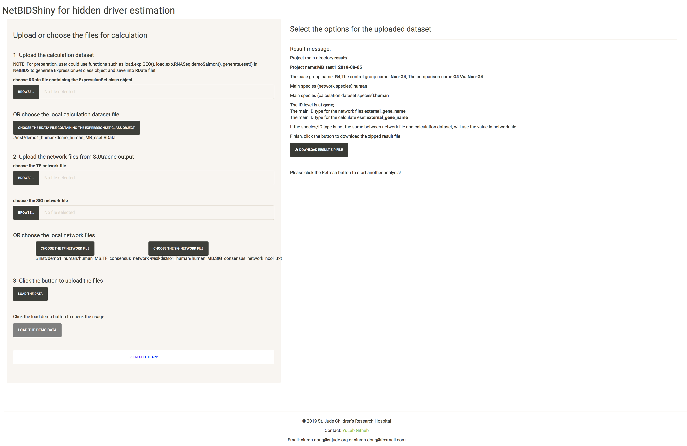
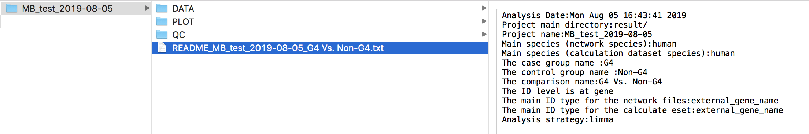

# Tutorial for Master regulator estimation

The purpose of NetBIDshiny: 

**provide an interactive online tool for master regulator analysis and automatically output plots for top drivers**.

We use the same demo data set as in NetBID2, from GEO database: [GSE116028](https://www.ncbi.nlm.nih.gov/geo/query/acc.cgi?acc=GSE116028). 

----------
## Quick Navigation

- [Introduction to User Interface of NetBIDshiny](#introduction-to-user-interface-of-netbidshiny)

- [Upload the eset Rdata and network data](#upload-the-eset-rdata-and-network-data)

- [Select the options and start an analysis](#select-the-options-and-start-an-analysis)

---------

Start the app:

```r
NetBIDshiny.run4MR()
```

## Introduction to User Interface of NetBIDshiny

The following screenshot is the user interface of NetBIDshiny,


**The user interface consists of 2 parts:**

- Left panel is designed for uploading dataset, including the calculation dataset and two network files generated by SJAracne. 

- Right panel is for the options of the uploaded dataset, and start an automatically master regulator analysis.

-------

## Upload the eset Rdata and network data

We will use the dataset in NetBIDshiny package as a demo. User could directly click the "LOAD THE DEMO DATA" button the skip this step and check the next part usage.

For the calculation dataset, user could click the "BROWSE" button to upload the RData file or click the "CHOOSE THE RDATA FILE CONTAINING THE EXPRESSIONSET CLASS OBJECT" button to select the file in the local directory. 

For the two network files, similarly, user could choose to upload or choose from the local directory (this is essential if user want to deploy the app in a local lan environment, which could share network files by calculating or collecting them in advance).


After that, click the "LOAD THE DATA" button:


## Select the options and start an analysis

Follow the order of the box to select the options one by one, choose the main output directory and input the project name.

After all required options fixed, the page will be like this:



Click the "START THE DRIVER ESTIMATION ANALYSIS", wait (about 1~2 mins) until the Result message update like this:



If check the "Do plot for the top drivers" and the plot for top drivers will also be generated, which will take more time (about 1 mins).

Then, the analysis is done, follow the instructions on the page to find the output files. BTW, a README.txt file is generated in the output directory to record the options in this analysis.

It's especially worth mentioning that the RData file (here: RData file in ./inst/demo1/output/test1/DATA/analysis.par.Step.ms-tab.RData), could be used in the visualization app to draw more plots. Check the manual in the next section for more detail.

------


