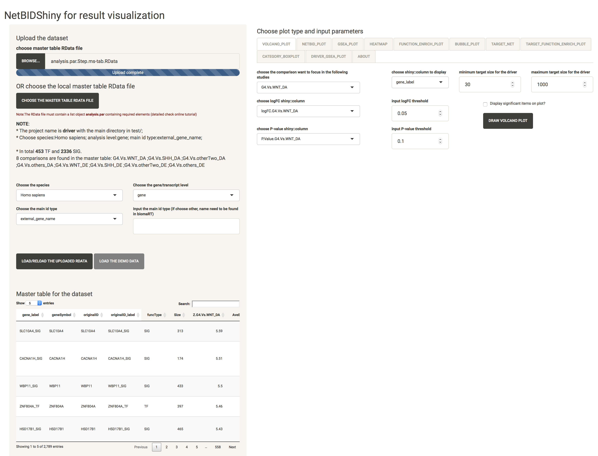
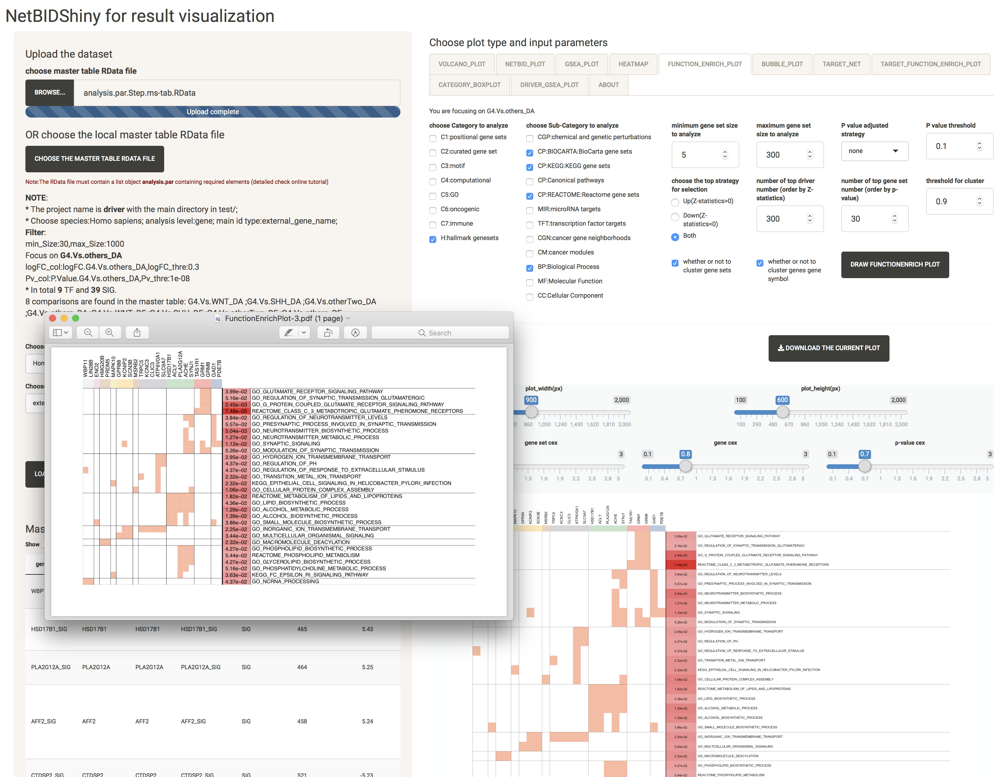
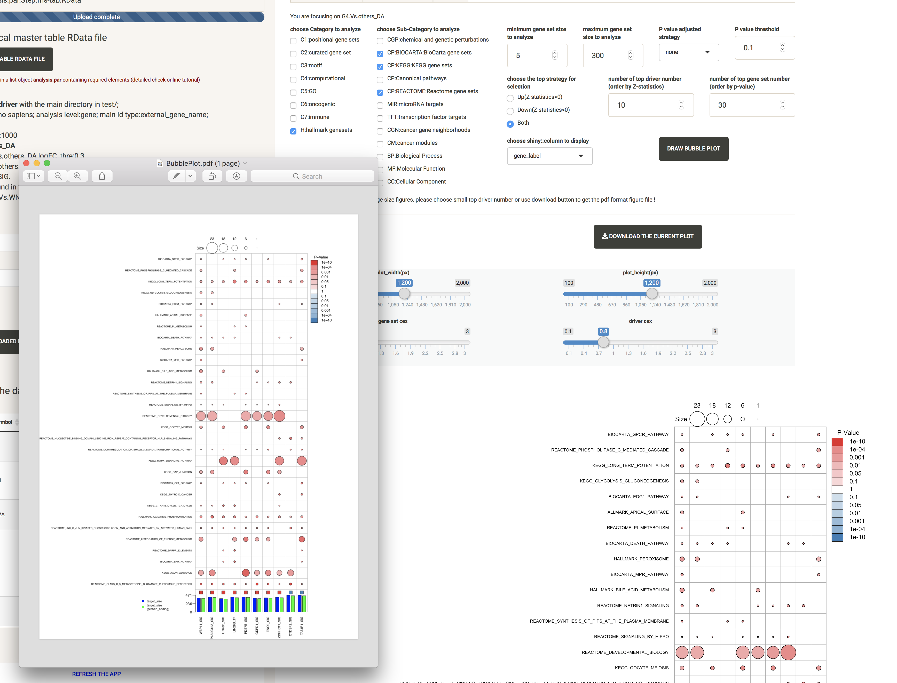

# Tutorial for Visualization

The purpose of NetBIDshiny: 

**provide an interactive online visualization tool for further analysis of drivers**.

We use the same demo data set as in NetBID2, from GEO database: [GSE116028](https://www.ncbi.nlm.nih.gov/geo/query/acc.cgi?acc=GSE116028). 

This microarray dataset contains 13 adult medulloblastoma (MB) samples. 
Three phenotype subgroups of adult MB have been identified from distinguishabled expression profiles, clinical features, pathological features and prognosis.
These subgroups together with their sample numbers are, 3 SHH, 4 WNT, and 6 Group4.
Group4 tumors in adult have significantly worse progression-free and overall survival, compared to other molecular subtypes of tumor.
Here, the goal is to **find potential drivers in Group4 compared to other subtypes using NetBID2**. This may relate to specific clinical feature of Group4 MB subtype.

----------
## Quick Navigation

- [Introduction to User Interface of NetBIDshiny](#introduction-to-user-interface-of-netbidshiny)

- [Upload the RData](#upload-the-rdata)

- [Navigate through the master table](#navigate-through-the-master-table)

- [Plots](#plots)

  - [VOLCANO_PLOT: quickly identify the top differentially expressed/activated drivers](#volcano_plot-quickly-identify-the-top-differentially-expressedactivated-drivers)

  - [NETBID_PLOT: get the statistics of the top differentially expressed/activated drivers](#netbid_plot-get-the-statistics-of-the-top-differentially-expressedactivated-drivers)

  - [GSEA_PLOT: get the detailed statistics of the top differentially expressed/activated drivers](#gsea_plot-get-the-detailed-statistics-of-the-top-differentially-expressedactivated-drivers)

  - [HEATMAP: get the expression/activity pattern of the top drivers across all samples](#heatmap-get-the-expressionactivity-pattern-of-the-top-drivers-across-all-samples)

  - [FUNCTION_ENRICH_PLOT: get the functional annotation for the top drivers](#function_enrich_plot-get-the-functional-annotation-for-the-top-drivers)

  - [BUBBLE_PLOT: get the functional annotation for the top drivers and their target genes](#bubble_plot-get-the-functional-annotation-for-the-top-drivers-and-their-target-genes)

  - [TARGET_NET: show the sub-network structure of one selected driver](#target_net-show-the-sub-network-structure-of-one-selected-driver)

  - [CATEGORY_BOXPLOT: get the distribution of one driver’s expression/activity value across group samples](#category_boxplot-get-the-distribution-of-one-drivers-expressionactivity-value-across-group-samples)

- [Q & A: How to share results with others by deploying the application by having pre-generated result RData dataset ?](#q--a-how-to-share-results-with-others-by-deploying-the-application-by-having-pre-generated-result-rdata-dataset-)

---------

Start the app:

```r
NetBIDshiny.run4Vis()
```

## Introduction to User Interface of NetBIDshiny

The following screenshot is the user interface of NetBIDshiny,


**The user interface consists of 4 parts:**

- Top left is for target dataset manipulation. Users can upload the target Rdata from local path, choose species name, analysis level and ID type for analysis. We also provide a button to load the demo dataset, so users can have a taste of how NetBIDshiny works.

- Bottom left is for master table display. Each row is a driver, containing all the statistics calculated by NetBID2 analysis.

- Top right is for plot type selection, with plot type tabs and options.

- Bottom right is the plot panel. It includes adjusting bars and figure download button. Users can save the plot as PNG by right click, or click the button to download it as PDF.

**Plot types and tabs:**

- **VOLCANO_PLOT**, the volcano plot used to quickly identify the top differentially expressed/activated drivers. Created by `draw.volcanoPlot()` in NetBID2.
- **NETBID_PLOT**, the NETBID plot used to get the statistics of the top differentially expressed/activated drivers. Created by `draw.NetBID()` in NetBID2.
- **GSEA_PLOT**, the GSEA plot used to get the detailed statistics of the top differentially expressed/activated drivers. Created by `draw.GSEA.NetBID()` in NetBID2.
- **HEATMAP**, the heatmap used to get the expression/activity pattern of the top drivers across all samples. Created by `draw.heatmap()` in NetBID2.
- **FUNCTION_ENRICH_PLOT**, the Function Enrichment plot used to get the functional annotation for the top drivers. Created by `draw.funcEnrich.cluster()` in NetBID2.
- **BUBBLE_PLOT**, the bubble plot used to get the functional annotation for the top drivers and their target genes. Created by `draw.bubblePlot()` in NetBID2.
- **TARGET_NET** , the Target Network plot used to show the sub-network structure of one selected driver. Created by `draw.targetNet()` and `draw.targetNet.TWO()` in NetBID2.
- **CATEGORY_PLOT**, the grouped box plot used to get the distribution of one driver's expression/activity value across group samples. Created by `draw.categoryValue()` in NetBID2.

## Upload the RData

**Before start, take a quick review of the target RData generation.**

The input RData is a super list object `analysis.par` with multiple elements wrapped inside, which including the master table. 
It is created by the "Driver Estimation" step in NetBID2 analysis. It is saved as RData using this command `NetBID.saveRData(analysis.par=analysis.par,step='ms-tab')`. For details, please check the drivers estimation pipeline from NetBID2 online tutorial. The RData is saved in `analysis.par$out.dir.DATA` directory, with file name `analysis.par.Step.ms-tab.RData`. 

Details about the `analysis.par` Rdata:

- **main.dir**, the main directory of the project, required by NetBIDshiny. 
- **project.name**, the project name, required by NetBIDshiny. 
- **merge.network**, a list with three elements (`target_list`, `igraph_obj` and `target_net`) which contains the detailed network structure from the NetBID, required by NetBIDshiny.
- **cal.eset**, an ExpressionSet class object storing the expression matrix, phenotype information and feature informaiton, required by NetBIDshiny.
- **merge.ac.eset**, an ExpressionSet class object for the activity value of the analysis dataset, required for NetBIDshiny.
- **final_ms_tab**, a data frame containing detailed results for all tested drivers, required by NetBIDshiny.
- **transfer_tab**, a data frame for ID conversion. It is suggested but not required to run NetBIDshiny. If it is not included in the uploading RData, NetBIDshiny will automatically generate one.
- out.dir (out.dir.QC, out.dir.DATA, out.dir.PLOT), the directory and sub-directories of NetBID project, not required by NetBIDshiny. 
- DE and DA, contain detailed differential expression (DE)/activity (DA) statistics, not required by NetBIDshiny.

**Upload the RData.**

Click the **BROWSE** button and select the target RData file from your PC.
Then, please choose:

- the species name in the select list (currently only 11 species is allowed, due to the MSigDB annotation limitation). 
- the gene/transcript level, this is the level of the driver's main ID type.
- the main ID type, please select the ID type for your drivers (the select list has 10 most common ID types). If it is not listed, user can enter it manually in the textbox on the right. For access to the full list of allowed ID types, please check [biomaRt](https://www.bioconductor.org/packages/devel/bioc/vignettes/biomaRt/inst/doc/biomaRt.html) or try the scripts below.

```r
ensembl <- useMart("ensembl", dataset="hsapiens_gene_ensembl")
listAttributes(ensembl)
```

If there is an error message **maximum upload size exceeded**, please set `options(shiny.maxRequestSize = 300*1024^2)` to a larger number. Here the options means the maximum request size is 300mb. 

Then click the **LOAD/RELOAD THE UPLOADED RDATA** button to load the target RData. For demo RData, user can directly click the **LOAD/RELOAD THE DEMO RDATA** button.
After the upload of the targe RData, the master table and the "NOTE" messages will be displayed. And the **VOLCANO_PLOT**,**TARGET_NET**, **CATEGORY_PLOT** tabs are available.
Now the interface will look like this,



As shown above, the "NOTE" messages show the project name, main directory, the species name, analysis level, main ID type and the number of TF (transcription factors) and SIG (signalling factors). If the first selection is wrong, user can re-select everything and click **LOAD/RELOAD THE UPLOADED RDATA** button for reload.

**About data uploading time.** It will take 3~4 seconds for the demo dataset to upload. If your target dataset is large but contains the ID conversion table, for example the RData size is about 120 MB, it will take 10~15 seconds for uploading. Otherwise it will take longer time to upload (20~40 seconds from test), because acquiring data from bioMart website takes time (varies from the internet speed).

User could also choose the RData file pre-saved in the application folders by click the **CHOOSE THE MASTER TABL RDATA FILE** (this function is very important for result sharing):


## Navigate through the master table

The bottom left of the interface displays the master table. User can search the whole table by keywords and sort columns by clicking the column names. The first four columns are freezed. 

- For one master table, it consists of three parts:
  - The first six columns are `gene_label`, `geneSymbol`, `originalID`, `originalID_label`, `funcType` and `Size`.
    - `gene_label` is the driver's gene symbol or transcript symbol, with suffix "_TF" or "_SIG" to show driver's type. 
    - `geneSymbol` is the driver's gene symbol or transcript symbol, without suffix.
    - `originalID` is the original ID type used in network construction, which should match the ID type in `analysis.par$cal.eset`, `analysis.par$DE`.
    - `originalID_label` is the original ID type with suffix "_TF" or "_SIG", which should match the the ID type in `analysis.par$merge.network`, `analysis.par$merge.ac.eset`,`analysis.par$DA`.
    - **`originalID_label`** is the only column to ensure unique ID for row record.
    - `funcType` is either "TF" or "SIG" to mark driver's type. 
    - `Size` is number of target genes for the driver. 
  - The statistical columns are named as `prefix.comp_name_{DA or DE}`. The `prefix` can be `Z`, `P.Value`, `logFC` or `AveExpr` to indicate which statistical value is stored. The `comp_name` is the comparison name. For example, `Z.G4.Vs.WNT_DA` means the Z-statistics of the differential activity (DA) calculated from comparison between phenotype G4 and phenotype WNT. The color shade of the background indicated the significance of Z-statistics.
  - The next 13 columns (from `ensembl_gene_id` to `refseq_mrna`) are detailed information of genes.
  - The last columns (optional) are the detailed information of marker genes, users use `mark_strategy='add_column'` to set.

## Plots

### VOLCANO_PLOT: quickly identify the top differentially expressed/activated drivers

The volcano plot is IMPORTANT in NetBIDshiny, because the activation of **NETBID_PLOT**, **GSEA_PLOT**, **HEATMAP**, **FUNCTION_ENRICH_PLOT** and **BUBBLE_PLOT** is highly dependent on that. If draw these plots without the activation of the volcano plot, a warning message will show up ("Please plot volcano plot first in order to choose the targeted comparison !"").

Since the differential expression (DE)/activity (DA) statistics are calculated from certain comparisons, users need to choose which comparison to visualize. Users can also adjust the threshold for P-values, logFC and driver's target size.

Here, we selected `G4.Vs.others_DA` as the comparison, and chose the logFC column and P-value column (if not chosen, it will automatically change to the columns related to the comparison). Set the logFC threshold to 0.3, P-value threshold to 1e-8, minimum target size to 30 and maximum target size to 1000, and checked the `Display significant items on plot?` box. The plot created is shown as below,


At the bottom, the MESSAGE shows that 48 drivers have passed by the filter. User can modify the selections to get another top driver list. Click the **UPDATE THE MASTER TABLE BY USING THE PARAMETERS AND TOP NUMBER ABOVE** button after selection, the interface will look like this,


**NOTE:** In the **NETBID_PLOT**, **GSEA_PLOT**, **HEATMAP**, **FUNCTION_ENRICH_PLOT** and **BUBBLE_PLOT**, the top list is based on the ranking of the Z-statistics. If user only want the Z-statistics as the criteria to get the top driver list, it is not necessary to update the master table. Otherwise, the update step is necessary. (For example, if user only want to focus on drivers with target size ranges from 30 to 500, he need to set this filter and update the master table first). When user click the **UPDATE THE MASTER TABLE BY USING THE PARAMETERS AND TOP NUMBER ABOVE** button, he will need to re-do the valcano plot step to define the main comparison again. 

### NETBID_PLOT: get the statistics of the top differentially expressed/activated drivers


### GSEA_PLOT: get the detailed statistics of the top differentially expressed/activated drivers


### HEATMAP: get the expression/activity pattern of the top drivers across all samples


### FUNCTION_ENRICH_PLOT: get the functional annotation for the top drivers

It uses the annotation from MSigDB database. User can choose multiple categories of gene sets and related statistics for calculation. As long as the main category is selected, all the gene sets from that category will be used, regardless of the selection of sub-category. For example, if user choose the 'C5:GO' main category, all 'BP', 'MF', 'CC' will be used. 



### BUBBLE_PLOT: get the functional annotation for the top drivers and their target genes

It uses the annotation from MSigDB database. The plot creation will take some time (around several seconds). The figure size could be very large and inconvenient to see. We suggest to download it as PDF.



### TARGET_NET: show the sub-network structure of one selected driver

For a better visualization of this highly overlapped network structure, we offer the adjustment of text size `cex` and `number of layers`.


If add one more interested driver, it will draw a shared sub-network with overlapped target genes in the middle.


### CATEGORY_BOXPLOT: get the distribution of one driver's expression/activity value across group samples

Users can choose which phenotype feature to display.


## Q & A: How to share results with others by deploying the application by having pre-generated result RData dataset ?

There is one option for running `NetBIDshiny.run4Vis()`. 

-- **search_path**, path for master table Rdata searching in the app server. User could choose from: 'Current Directory','Home','R Installation','Available Volumes', and could put user-defined server path (better use absolute path). Default is c('Current Directory','Home'). If set to NULL, only 'Current Directory' will be used.

If user want to deploy the application with pre-generated result RData files, he could run the application like this (below is the screenshot for the data directory for our online version, the code is slightly different to the code in the package and we use the original code for deploying. ):


And put the output directory as option to run the application:

```r
NetBIDshiny.run4Vis(search_path='data/project_RData/')
```

-------

