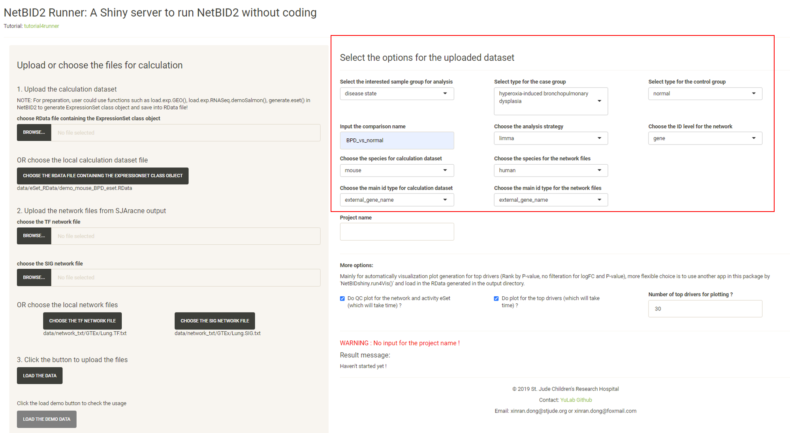
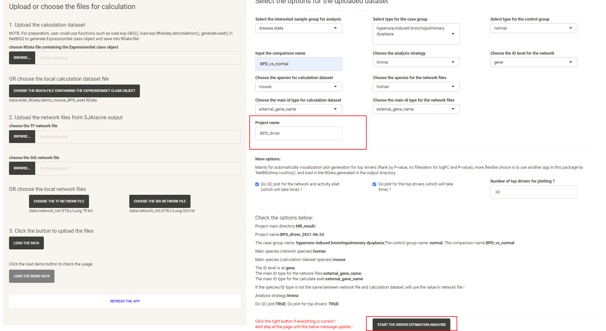

# Tutorial for the NetBIDshiny online server

The purpose of the NetBIDshiny online server: 

**provide pre-generated network files from TCGA, TARGET and GTEx to enable a quick start of NetBID2 analysis and provide demo datasets to enable quick familiarity with diverse types of NetBID2 result visualization**.

The public online version of NetBIDshiny can be found here [NetBIDshiny_runner](https://yulab-stjude.shinyapps.io/NetBID2_Runner/) and [NetBIDshiny_viewer](https://yulab-stjude.shinyapps.io/NetBID2_Viewer/). 

----------
## Quick Navigation

- [NetBIDshiny_runner: pre-generated network files and demo usage](#netbidshiny_runner-pre-generated-network-files-and-demo-usage)

- [NetBIDshiny_viewer: demo datasets and usage](#netbidshiny_viewer-demo-datasets-and-usage)

----------

## NetBIDshiny_runner: pre-generated network files and demo usage

### Pre-generated network files

#### GTEx

- Original transcriptome dataset from [GTEx](https://www.genome.gov/Funded-Programs-Projects/Genotype-Tissue-Expression-Project)

- We have pre-generated 96 networks from 48 tissues, with each tissue having one TF network and one SIG network. 

- The original sample information can be obtained from [GTEx_Analysis_v8_Annotations_SampleAttributesDS.txt](https://storage.googleapis.com/gtex_analysis_v8/annotations/GTEx_Analysis_v8_Annotations_SampleAttributesDS.txt)

- The original gene expression profile can be obtained from [GTEx_Analysis_2017-06-05_v8_RNASeQCv1.1.9_gene_reads.gct.gz](https://storage.googleapis.com/gtex_analysis_v8/rna_seq_data/GTEx_Analysis_2017-06-05_v8_RNASeQCv1.1.9_gene_reads.gct.gz)

- Detailed network QC files could be found in [GTEx_network](tutorial4online/GTEx_network)

#### TARGET

- Original transcriptome dataset from [TARGET](https://portal.gdc.cancer.gov/)

- We have pre-generated 102 networks from 51 cell lines, with each cell line having one TF network and one SIG network.

- Detailed network QC files could be found in [TARGET_network](tutorial4online/TARGET_network)

#### TCGA

- Original transcriptome dataset from [TCGA](https://portal.gdc.cancer.gov/)

- We have pre-generated 92 networks from 46 tumor types, with each tumor type having one TF network and one SIG network.

- Detailed network QC files could be found in [TCGA_network](tutorial4online/TCGA_network)

### Demo usage

We have used the mouse BPD (bronchopulmonary dysplasia) demo dataset from the GEO database [GSE25286](https://www.ncbi.nlm.nih.gov/geo/query/acc.cgi?acc=GSE25286), with network files generated by using normal human lung tissue from GTEx (human). The task is to find drivers in BPD vs normal samples. 

Go to the online version at [NetBIDshiny_runner](https://yulab-stjude.shinyapps.io/NetBID2_Runner/).  

Click the `CHOOSE THE RDATA FILE CONTAINING THE EXPRESSIONSET CLASS OBJECT` button and select the RData `demo_mouse_BPD_eset.RData`.

Click the `CHOOSE THE TF NETWORK FILE` button and select the network txt file with the suffix `TF.txt` under the `GTEx/` directory. 

Click the `CHOOSE THE SIG NETWORK FILE` button and select the network txt file with the suffix `SIG.txt` under the `GTEx/` directory. 

Click the `LOAD THE DATA` button and options will appear in the right panel.

Modify the options.

Input the `Project name` and the `START THE DRIVER ESTIMATION ANALYSIS` button will appear. 
Click the `START THE DRIVER ESTIMATION ANALYSIS` button.

Wait approximately 3-5mins, and the website will turn to the result page. Click the `DOWNLOAD RESULT ZIP FILE` button to download the result zip file.

Unzip the file and all of the related results will be in the directory. Here, the `analysis.par.Step.ms-tab.RData` file under the `MR_result/{project_name}/DATA/` directory can be directly uploaded to the [NetBIDshiny_viewer](https://yulab-stjude.shinyapps.io/NetBID2_Viewer/) server for result visualization. 

## NetBIDshiny_viewer: demo datasets and usage

GO TO [NetBIDshiny_viewer](https://yulab-stjude.shinyapps.io/NetBID2_Viewer/).

### The default demo dataset is

-- the human MB (medulloblastoma) demo dataset from the GEO database: [GSE116028](https://www.ncbi.nlm.nih.gov/geo/query/acc.cgi?acc=GSE116028) as used in NetBID2, with network files generated by using the same dataset. The task is to find drivers in Group4 (G4) MB vs other subtypes. 

When the server is opened, the human MB demo dataset will be uploaded directly:

Wait until the following page appears:

This is the main page for the NetBIDshiny viewer. It contains the following main parts (which are nearly the same as those of the interface of the NetBIDshiny local version).

Click on the different tabs to draw more plots (we have not provided a detailed tutorial here as the [Tutorial for viewer](docs/tutorial4viewer) also shows this demo.).

### Other demo dataset.

The online server also contain another mouse BPD demo dataset for result visualization: 
-- the mouse BPD (bronchopulmonary dysplasia) demo dataset from the GEO database [GSE25286](https://www.ncbi.nlm.nih.gov/geo/query/acc.cgi?acc=GSE25286), with network files generated by using normal human lung tissue from GTEx (human). The task is to find drivers in BPD vs normal samples in P14. 

Click the `CHOOSE THE MASTER TABLE RDATA FILE` button, and a new window containing the demo dataset will appear. Click to choose the `GSE25286_P14_BPD_vs_normal.RData`. Click `SELECT`.

Click the `LOAD/RELOAD THE UPLOADED RDATA` button and the volcano plot will be displayed, quickly identifying the top differentially expressed/activated drivers. Because the differential expression (DE)/activity (DA) statistics are calculated from certain comparisons, the user needs to choose which comparison to visualize. The user can also adjust the threshold for P-values, logFC and driver target size.

Click the tab `NETBID_PLOT`, then click the `DRAW NETBID PLOT` button and the NETBID plot will be displayed, showing the statistics for the top differentially expressed/activated drivers. Two side-by-side heatmaps are created to show the result of the NetBID analysis. Both the differential expression analysis (the right heatmap) and the differential activity analysis (the left heatmap) of top drivers are shown in the plot.

Click the tab `GSEA_PLOT`, then click the `DRAW GSEA PLOT` button, and the GSEA plot will be displayed, showing detailed statistics forthe top differentially expressed/activated drivers, such as the number of target genes, the ranking of the target genes in the differential expression file, and the differential expression (DE) and differential activity (DA) values.

Click the tab `HEATMAP`, then click the `DRAW HEATMAP` button, and the heatmap will be displayed, showing the expression/activity pattern of the top drivers across all samples.

Click the tab `FUNCTION_ENRICH_PLOT`, then click the `DRAW FUNCTION ENRICH PLOT` button and the netbid plot will be displayed, showing the functional annotation for the top drivers. This uses the annotation from the MSigDB database. The user can choose multiple categories of gene sets and related statistics for the calculation. As long as the main category is selected, all of the gene sets from that category will be used, regardless of the sub-category selected. For example, if the user chooses the 'C5:GO' main category, all 'BP', 'MF', 'CC' will be used. The software draws a cluster plot based on a binary matrix, to visualize the existence of genes in the enriched gene sets. The P-value of the enrichment is also displayed in the plot.

Click the tab `BUBBLE_PLOT`, then click the `DRAW BUBBLE PLOT` button and the bubble plot will be displayed, showing the functional annotation for the top drivers and their target genes. This uses the annotation from the MSigDB database. It combines the matrix bubble chart and the heat map, using the bubble color to compare P-values (performed by Fisher's Exact Test) and the bubble size to compare the intersection size for target genes. Rows are enriched gene sets, columns are top drivers. The user can also check the number of protein-coding genes targeted by each driver. The plot creation will take several seconds. As the figure can be very large and inconvenient to view, we recommend downloading it as a PDF.

Click the tab `TARGET_NET`, then click the `DRAW TARGETNET PLOT` button, and the target network plot will be displayed, which showing the sub-network structure of a selected driver or a pair of selected drivers. Edges of positively-regulated target genes are orange, edges of negatively-regulated target genes are green. The width of the edges shows the strength of regulation.

Click the tab `TARGET_FUNCTION_ENRICH_PLOT`, then click the `DRAW TARGET FUNCTION ENRICH PLOT` button, and the function enrichment plot for the selected driver will be displayed, showing the functional annotation for the target genes of the driver. 

Click the tab `CATEGORY_BOXPLOT`, then click the `DRAW CATEGORY BOXPLOT` button and the boxplot will be displayed, showing the distribution of the expression/activity values of a driver across the group of samples. 

Click the tab `DRIVER_GSEA_PLOT`, then click the `DRAW DRIVER GSEA PLOT` button and the GSEA plot for a selected driver will be displayed. 

P.S:  The bottom right panel is the plot panel. It includes adjustment bars and a figure download button. The user can save the plot as a PNG by a right click, or click the button to download it as a PDF.

