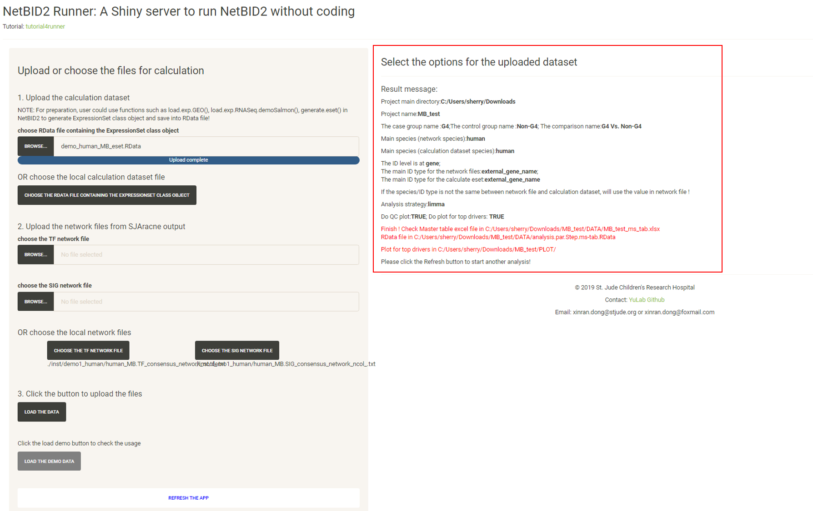

# Tutorial for Hidden driver estimation

The purpose of NetBIDshiny: 

**Provide an interactive online tool for hidden driver analysis and automatically output plots for top drivers**.

We have chosen the following datasets:

1. The human MB (medulloblastoma) demo dataset from the GEO database as in NetBID2: [GSE116028](https://www.ncbi.nlm.nih.gov/geo/query/acc.cgi?acc=GSE116028), with network files generated by using the same dataset.

2. The mouse BPD (bronchopulmonary dysplasia) demo dataset from the GEO database [GSE25286](https://www.ncbi.nlm.nih.gov/geo/query/acc.cgi?acc=GSE25286), with network files generated by using normal lung tissue from [GTEx](https://gtexportal.org/home/) (human).

For a tutorial on the online server [NetBIDshiny_runner](https://yulab-stjude.shinyapps.io/NetBID2_Runner/), visit [tutorial4online](tutorial4online).

----------
## Quick Navigation

- [Introduction to the User Interface of NetBIDshiny](#introduction-to-the-user-interface-of-netbidshiny)

- [Upload the eset Rdata and network data](#upload-the-eset-rdata-and-network-data)

- [Select the options and start an analysis](#select-the-options-and-start-an-analysis)

- [Quick demo for the mouse dataset](#quick-demo-for-the-mouse-dataset)

- [Q & A: How do I prepare an eSet class object RData file ?](#q--a-how-do-i-prepare-an-eset-class-object-rdata-file-)

- [Q & A: How do I use self-defined network files ?](#q--a-how-do-i-use-self-defined-network-files-)

- [Q & A: How do I use the software if I have only a TF network without a SIG network ?](#q--a-how-do-I-use-the-software-if-i-have-only-a-tf-network-without-a-sig-network-)

- [Q & A: How do I deploy the application by having pre-generated network files or calculation  datasets ?](#q--a-how-do-i-deploy-the-application-by-having-pre-generated-network-files-or-calculation-datasets-)

---------

We can start the app by directly calling the function, or we can choose to settle down the project main directory by setting the parameter in the function.  

```r
NetBIDshiny.runner()
# NetBIDshiny.runner(project_main_dir='result/')
```

## Introduction to the User Interface of NetBIDshiny

The following screenshot shows the user interface of NetBIDshiny,


**The user interface consists of 2 parts:**

- The left panel is designed for uploading a dataset, including the calculation dataset and two network files generated by [SJARACNe](https://github.com/jyyulab/SJARACNe). 

- The right panel is for selecting the options for the uploaded dataset and for starting an automatic hidden driver analysis.

-------

## Upload the eset Rdata and network data

We will use the human dataset in the NetBIDshiny package as a demo. The user can directly click the "LOAD THE DEMO DATA" button then skip this step and go to the next part on usage.

For the calculation dataset, the user can click the "BROWSE" button to upload the RData file or click the "CHOOSE THE RDATA FILE CONTAINING THE EXPRESSIONSET CLASS OBJECT" button to select the file in the local directory. 

Similarly, for the two network files, the user can choose to upload a file or choose from the local directory (this is essential if the user wants to deploy the app in a local LAN environment, in which network files can be shared by calculating or collecting them in advance).


## Select the options and start an analysis

Click the "LOAD THE DATA" button and follow the instructions in the box to select the options one by one and input the project name.

After all required options have been fixed, the page will appear as shown below:


Click the "START THE DRIVER ESTIMATION ANALYSIS", wait (approximately 1 to 2 minutes, more time may be needed if there is a poor connection to the Ensembl database for gene ID conversion) until the Result message update appears:



If the user checks "Do plot for the top drivers", plots for the top drivers will also be generated, which will take longer (approximately 1 minutes).

If the user inputs the `project_main_dir` when running the application, they will need to click to download the zipped result file; otherwise, the user needs to select the output directory in the previous step and need to follow the instructions on the page to find the output files. 

The result files will be structured like this:


A README.txt file is generated in the output directory to record the options in this analysis.

The DATA/ directory contains the result dataset, the final RData file including the network structure, the calculation dataset, the inferred activity, the differentiated statistics and the final master table for all tested drivers. The EXCEL file is the formatted result file for all drivers. 


The QC/ directory contains QC plots (if the user checks `Do QC plot for the network and activity eset`)


The PLOT/ directory contains plots for top drivers (if the user checks `Do plot for the top drivers`)


## Quick demo for the mouse dataset

We can input the mouse dataset but select human network files. Under this condition, NetBID2 will automatically perform ID transfer for the input mouse dataset and the final output will be at the human ID level. 

The user can try using the demo dataset in the NetBIDshiny package:


## Q & A: How do I prepare an eSet class object RData file ?

NetBID2 provides numerous functions to assist with eSet class object preparation.

Here, we show the codes for how preparing the mouse eSet class object RData file:

```r
mouse_eset <- load.exp.GEO(GSE='GSE25286',GPL='GPL1261',out.dir = 'mouse_BPD/')
mouse_eset <- update_eset.phenotype(mouse_eset,use_col='GEO-auto')
mouse_eset <- update_eset.feature(mouse_eset,use_feature_info = fData(mouse_eset),
              from_feature = 'ID',to_feature = 'Gene Symbol')
save(mouse_eset,file='mouse_BPD/eset.RData')
```

In view of the complexity of a gene expression profile dataset, we do not provide a function to generate an eSet class directly file in NetBIDshiny. 
The user can use the `generate.eset()` function in NetBID2 as a help.

## Q & A: How do I use self-defined network files ?

We have prepared a network in the NetBIDshiny package. Only two columns are required if the user wants to use networks not generated by [SJARACNe](https://github.com/jyyulab/SJARACNe). 
The user needs to name those two columns `source` and `target` to indicate the network direction. All nodes in the `source` column will be treated as drivers in the estimation.


## Q & A: How do I use the software if I have only a TF network without a SIG network ?

To avoid the condition in which the user forgets to upload the network files, we have prepared an empty network file in the NetBIDshiny package (`empty_network.txt`). The user can choose to upload or select this network file if they do not want the SIG network. (The same applies if the user has only the SIG network without the TF network) 

## Q & A: How do I deploy the application by having pre-generated network files or calculation datasets ?

Option I: The user can call the function for deploying the shiny application. There are three options for running `NetBIDshiny.runner()`. 

-- **search_network_path**: the path for network data searching in the application server. The user can choose from: 'Current Directory','Home','R Installation' and 'Available Volumes' and can input a user-defined server path (it is better to use the absolute path). The default is c('Current Directory','Home'). If set to NULL, only 'Current Directory' will be used.

-- **search_eSet_path**: the path for expressionSet class RData searching in the application server. The user can choose from: 'Current Directory','Home','R Installation' and 'Available Volumes' and can input a user-defined server path (it is better use the absolute path). The default is c('Current Directory','Home'). If set to NULL, only 'Current Directory' will be used.

-- **project_main_dir**: the absolute path of the main working directory for driver analysis. If NULL, the server will add a new button for the user to select the output directory. The default is NULL. If not NULL, there will be an additional link in the result page for downloading the zip file containing all of the information.

Input the directories as options to run the application:

```r
NetBIDshiny.runner(search_network_path='data/network_txt',
                  search_eSet_path='data/eSet_RData',
                  project_main_dir='MR_result/')
```

Option II: The user can copy the `server.R` and `ui.R` from the `inst/app_runner/` directory in the NetBIDshiny R package. Modify the code for path settings from line22-25 in `server.R` and organize the directories as follows (below is a screenshot of the data directory for our online version): 


Then, the user can deploy the servers by using RStudio `Publish Application` tools. 

------


