# Tutorial for Visualization

The purpose of NetBIDshiny: 

**Provide an interactive online visualization tool for further analysis of drivers**.

We will use the same demo data set from the GEO database as in NetBID2: [GSE116028](https://www.ncbi.nlm.nih.gov/geo/query/acc.cgi?acc=GSE116028). 

This microarray dataset contains 13 adult medulloblastoma (MB) samples. 
Three phenotype subgroups of adult MB have been identified based on distinguishable expression profiles, clinical features, pathologic features and prognosis.
These subgroups, together with their sample numbers, are SHH (3 samples), WNT (4 samples), and Group 4 (6 samples).
Group 4 tumors in adults have significantly worse progression-free and overall survival when compared with the other molecular subtypes of MB.
Here, the goal is to **find potential drivers in Group 4 tumors as compared to other subtypes by using NetBID2**. This may relate to specific clinical features of the Group4 MB subtype.

For a tutorial for the online server [NetBIDshiny_viewer](https://yulab-stjude.shinyapps.io/NetBID2_Viewer/), visit [tutorial4online](tutorial4online).

----------
## Quick Navigation

- [Introduction to the user Interface of NetBIDshiny](#introduction-to-the-user-interface-of-netbidshiny)

- [Upload the RData](#upload-the-rdata)

- [Navigate through the master table](#navigate-through-the-master-table)

- [Plots](#plots)

  - [VOLCANO_PLOT: quickly identifies the top differentially expressed/activated drivers](#volcano_plot-quickly-identifies-the-top-differentially-expressedactivated-drivers)

  - [NETBID_PLOT: provides the statistics for the top differentially expressed/activated drivers](#netbid_plot-provides-the-statistics-for-the-top-differentially-expressedactivated-drivers)

  - [GSEA_PLOT: provides detailed statistics for the top differentially expressed/activated drivers](#gsea_plot-provides-detailed-statistics-for-the-top-differentially-expressedactivated-drivers)

  - [HEATMAP: provides the expression/activity pattern of the top drivers across all samples](#heatmap-get-the-expressionactivity-pattern-of-the-top-drivers-across-all-samples)

  - [FUNCTION_ENRICH_PLOT: provides the functional annotation for the top drivers](#function_enrich_plot-provides-the-functional-annotation-for-the-top-drivers)

  - [BUBBLE_PLOT: provides the functional annotation for the top drivers and their target genes](#bubble_plot-provides-the-functional-annotation-for-the-top-drivers-and-their-target-genes)

  - [TARGET_NET: shows the sub-network structure of a selected driver](#target_net-shows-the-sub-network-structure-of-a-selected-driver)
  
  - [TARGET_FUNCTION_ENRICH_PLOT: provides the functional annotation for the target genes of the driver](#target_function_enrich_plot-provides-the-functional-annotation-for-the-target-genes-of-the-driver)

  - [CATEGORY_BOXPLOT: provides the distribution of the expression/activity values of a driver across the group of samples](#category_boxplot-provides-the-distribution-of-the-expressionactivity-values-of-a-driver-across-the-group-of-samples)
  
  - [DRIVER_GSEA_PLOT: provides the GSEA plot for a driver](#driver_gsea_plot-provides-the-gsea-plot-for-a-driver)

- [Q & A: How do I share results with others by deploying the application by having a pre-generated result RData dataset ?](#q--a-how-do-i-share-results-with-others-by-deploying-the-application-by-having-a-pre-generated-result-rdata-dataset-)

---------

We can start the app by directly calling the function, or we can choose to input the path for the RData file by setting the parameter in the function. If no option for `load_data_path` is set, the demo dataset will be automatically loaded when the application is opened.   

```r
NetBIDshiny.viewer()
# NetBIDshiny.viewer(load_data_path = system.file('demo1','driver/DATA/analysis.par.Step.ms-tab.RData',package = "NetBID2"))
```

## Introduction to the user interface of NetBIDshiny

The following screenshot shows the user interface of NetBIDshiny,

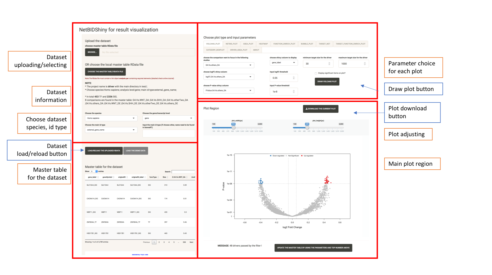

**The user interface consists of four parts:**

- The Top left panel is for target dataset manipulation. The user can upload the target Rdata from the local path and choose species name, analysis level, and ID type for analysis. We also provide a button to load the demo dataset, so that the user can have a taste of how NetBIDshiny works.

- The bottom left panel is the master table display. Each row is a driver, containing all of the statistics calculated by NetBID2 analysis.

- The top right panel is for plot type selection, with plot type tabs and options.

- The bottom right panel is the plot panel. This includes adjustment bars and a figure download button. The user can save the plot as a PNG by a right click or click the button to download it as PDF.

**Plot types and tabs:**

- **VOLCANO_PLOT**, the volcano plot used to identify the top differentially expressed/activated drivers quickly. Created by `draw.volcanoPlot()` in NetBID2.
- **NETBID_PLOT**, the NETBID plot used to obtain the statistics for the top differentially expressed/activated drivers. Created by `draw.NetBID()` in NetBID2.
- **GSEA_PLOT**, the GSEA plot used to obtain the detailed statistics of the top differentially expressed/activated drivers. Created by `draw.GSEA.NetBID()` in NetBID2.
- **HEATMAP**, the heatmap used to obtain the expression/activity pattern of the top drivers across all samples. Created by `draw.heatmap()` in NetBID2.
- **FUNCTION_ENRICH_PLOT**, the Function Enrichment plot used to obtain the functional annotation for the top drivers. Created by `draw.funcEnrich.cluster()` in NetBID2.
- **BUBBLE_PLOT**, the bubble plot used to obtain the functional annotation for the top drivers and their target genes. Created by `draw.bubblePlot()` in NetBID2.
- **TARGET_NET** , the Target Network plot used to show the sub-network structure of a selected driver. Created by `draw.targetNet()` and `draw.targetNet.TWO()` in NetBID2.
- **CATEGORY_PLOT**, the grouped box plot used to obtain the distribution of the expression/activity value of a driver across group samples. Created by `draw.categoryValue()` in NetBID2.

## Upload the RData

**Before starting, quickly review the generation of target RData.**

The input RData is a super list object `analysis.par` with multiple elements wrapped inside, including the master table. 
It is created by the "Driver Estimation" step in NetBID2 analysis. It is saved as RData by using this command `NetBID.saveRData(analysis.par=analysis.par,step='ms-tab')`. For details, please see the driver estimation pipeline in the NetBID2 online tutorial. The RData is saved in the `analysis.par$out.dir.DATA` directory with the file name `analysis.par.Step.ms-tab.RData`. 

Details about the `analysis.par` Rdata:

- **main.dir**, the main directory of the project; required by NetBIDshiny. 
- **project.name**, the project name; required by NetBIDshiny. 
- **merge.network**, a list with three elements (`target_list`, `igraph_obj` and `target_net`) that contains the detailed network structure from NetBID; required by NetBIDshiny.
- **cal.eset**, an ExpressionSet class object storing the expression matrix, phenotype information, and feature information; required by NetBIDshiny.
- **merge.ac.eset**, an ExpressionSet class object for the activity value of the analysis dataset; required for NetBIDshiny.
- **final_ms_tab**, a data frame containing detailed results for all tested drivers; required by NetBIDshiny.
- **transfer_tab**, a data frame for ID conversion. It is recommended but not required in order to run NetBIDshiny. If this data frame is not included in the uploaded RData, NetBIDshiny will automatically generate it.
- out.dir (out.dir.QC, out.dir.DATA, out.dir.PLOT), the directory and sub-directories of the NetBID project; not required by NetBIDshiny. 
- DE and DA, containing detailed differential expression (DE)/activity (DA) statistics; not required by NetBIDshiny.

**Upload the RData.**

Click the **BROWSE** button and select the target RData file from your PC.
Then, please choose the following:

- The species name in the selection list (currently only 11 species are available because of the limitation on MSigDB annotation). 
- The gene/transcript level. This is the level of the main ID type of the driver.
- The main ID type. Please select the ID type for your drivers (the selection list has the 10 most common ID types). If the ID type is not listed, the user can enter it manually in the textbox on the right. For access to the full list of available ID types, please check [biomaRt](https://www.bioconductor.org/packages/devel/bioc/vignettes/biomaRt/inst/doc/biomaRt.html) or try the scripts below.

```r
ensembl <- useMart("ensembl", dataset="hsapiens_gene_ensembl")
listAttributes(ensembl)
```

If the error message **maximum upload size exceeded** appears, please set `options(shiny.maxRequestSize = 300*1024^2)` to a larger number. Here the options mean that the maximum request size is 300MB. 

Then click the **LOAD/RELOAD THE UPLOADED RDATA** button to load the target RData. For the demo RData, the user can directly click the **LOAD/RELOAD THE DEMO RDATA** button.
After the target RData is uploaded, the master table and the "NOTE" messages will be displayed and the **VOLCANO_PLOT**,**TARGET_NET**, **CATEGORY_PLOT** tabs are available.
Now the interface will look like this,

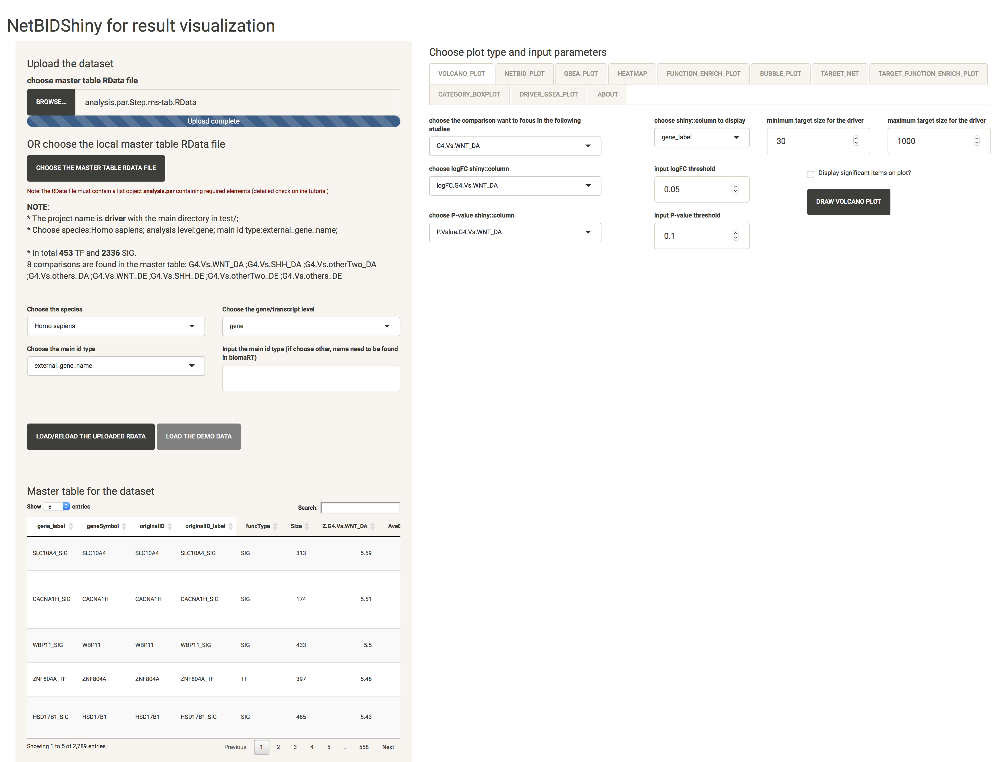

As shown above, the "NOTE" messages show the project name, the main directory, the species name, the analysis level, the main ID type, and the number of TFs (transcription factors) and SIGs (signalling factors). If the first selection is wrong, the user can re-select everything and click **LOAD/RELOAD THE UPLOADED RDATA** button to reload.

**Data uploading time.** It will take 3 to 4 seconds for the demo dataset to upload. If your target dataset is large but contains the ID conversion table, for example, if the RData size is approximately 120 MB, it will take 10 to 15 seconds to upload. Otherwise, it will take longer to upload (20 to 40 seconds from test), because acquiring data from the bioMart website takes time (which varies depending on the internet speed).

The user can also choose the RData file that is pre-saved in the application folders by clicking the **CHOOSE THE MASTER TABL RDATA FILE** (this function is very important for result sharing):

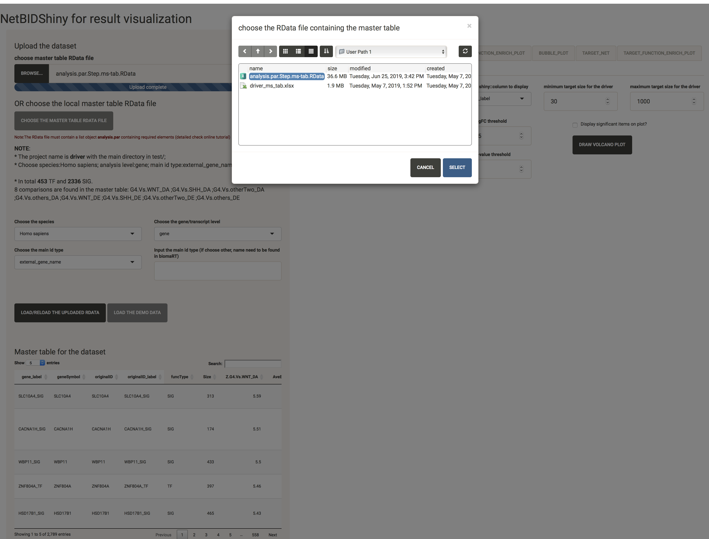

## Navigate through the master table

The bottom left of the interface displays the master table. The user can search the whole table by using keywords and sort the columns by clicking the column names. The first four columns are frozen. 

- A master table consists of three parts:
  - The first six columns are `gene_label`, `geneSymbol`, `originalID`, `originalID_label`, `funcType` and `Size`.
    - `gene_label` is the gene symbol or transcript symbol of the driver, with the suffix "_TF" or "_SIG" to show the driver type. 
    - `geneSymbol` is the gene symbol or transcript symbol of the driver, without a suffix.
    - `originalID` is the original ID type used in the network construction, which should match the ID type in `analysis.par$cal.eset`, `analysis.par$DE`.
    - `originalID_label` is the original ID type with the suffix "_TF" or "_SIG", which should match the ID type in `analysis.par$merge.network`, `analysis.par$merge.ac.eset`,`analysis.par$DA`.
    - **`originalID_label`** is the only column to ensure a unique ID for the row record.
    - `funcType` is either "TF" or "SIG" to mark the driver type. 
    - `Size` is the number of target genes for the driver. 
  - The statistical columns are named as `prefix.comp_name_{DA or DE}`. The `prefix` can be `Z`, `P.Value`, `logFC`, or `AveExpr` to indicate which statistical value is stored. The `comp_name` is the comparison name. For example, `Z.G4.Vs.WNT_DA` means the Z-statistics of the differential activity (DA) calculated from comparison between the G4 phenotype and the WNT phenotype. The color of the background indicates the significance of the Z-statistics.
  - The next 13 columns (from `ensembl_gene_id` to `refseq_mrna`) contain detailed information on the genes.
  - The last columns (optional) contain the detailed information on the marker genes; the user can use `mark_strategy='add_column'` to set this.

## Plots

### VOLCANO_PLOT: quickly identifies the top differentially expressed/activated drivers

The volcano plot is IMPORTANT in NetBIDshiny, because the activation of **NETBID_PLOT**, **GSEA_PLOT**, **HEATMAP**, **FUNCTION_ENRICH_PLOT** and **BUBBLE_PLOT** is highly dependent on it. If you draw these plots without activating the volcano plot, a warning message will appear: "Please plot volcano plot first in order to choose the targeted comparison !".

Because the differential expression (DE)/differential activity (DA) statistics are calculated from certain comparisons, the user needs to choose which comparison to visualize. The user can also adjust the threshold for P-values, logFC, and driver target size.

Here, we have selected `G4.Vs.others_DA` as the comparison, and have chosen the logFC column and the P-value column (if not chosen, the columns will automatically change to the columns related to the comparison). Set the logFC threshold to 0.3, the P-value threshold to 1e-8, the minimum target size to 30, and the maximum target size to 1000 and check the `Display significant items on plot?` box. The plot created is shown as below:

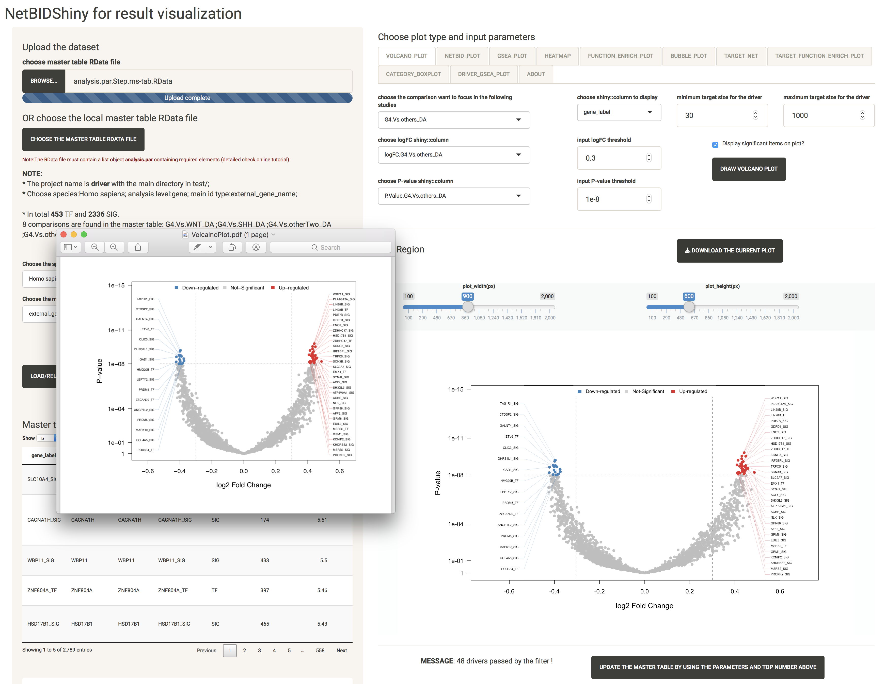

At the bottom of the screen, the MESSAGE shows that 48 drivers have passed by the filter. The user can modify the selections to obtain another top driver list. Click the **UPDATE THE MASTER TABLE BY USING THE PARAMETERS AND TOP NUMBER ABOVE** button after selection, and the interface will look like this:

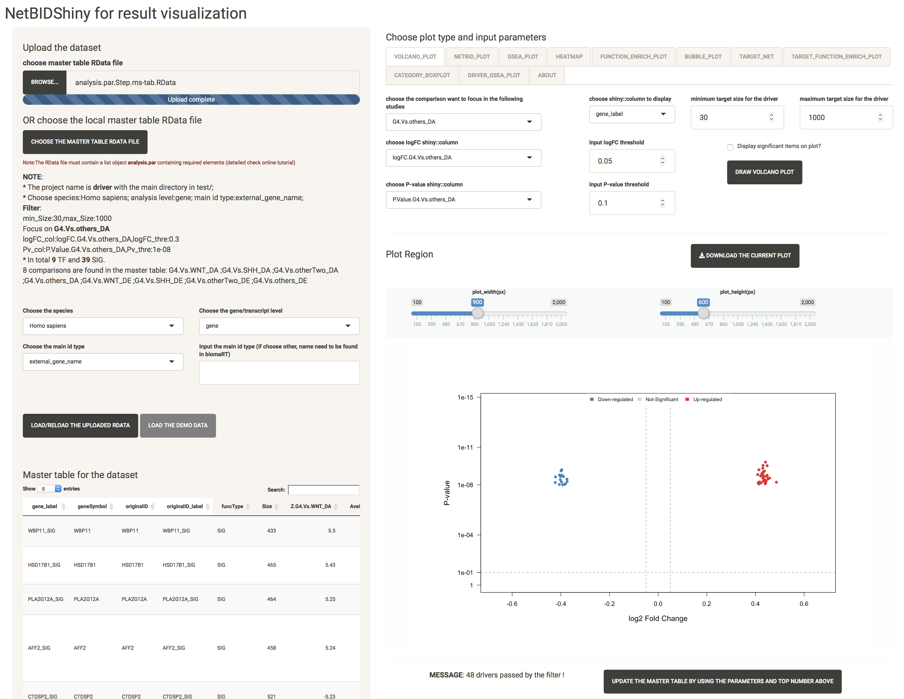

**NOTE:** In the **NETBID_PLOT**, **GSEA_PLOT**, **HEATMAP**, **FUNCTION_ENRICH_PLOT** and **BUBBLE_PLOT**, the top list is based on the ranking of the Z-statistics. If the user wants only the Z-statistics as the criteria with which to obtain the top driver list, it is not necessary to update the master table. Otherwise, the update step is necessary. (For example, if the user wants only to focus on drivers with target sizes ranging from 30 to 500, they need to set this filter and update the master table first). When the user clicks the **UPDATE THE MASTER TABLE BY USING THE PARAMETERS AND TOP NUMBER ABOVE** button, they will need to re-do the volcano plot step to define the main comparison again. 

### NETBID_PLOT: provides the statistics for the top differentially expressed/activated drivers

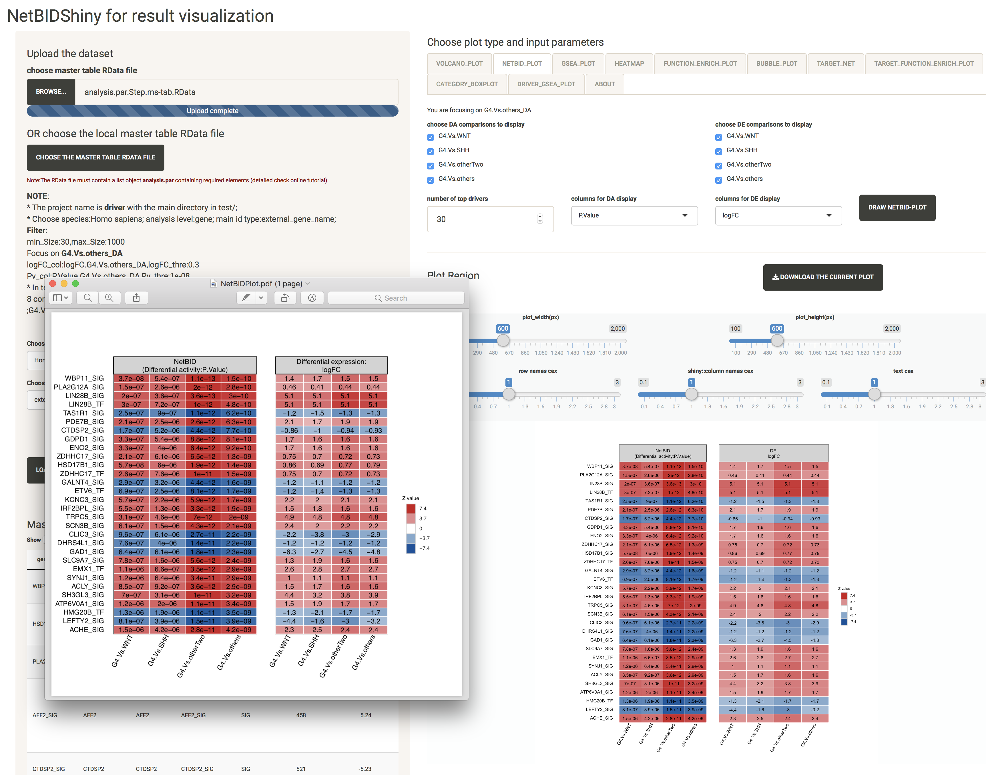

### GSEA_PLOT: provides detailed statistics of the top differentially expressed/activated drivers

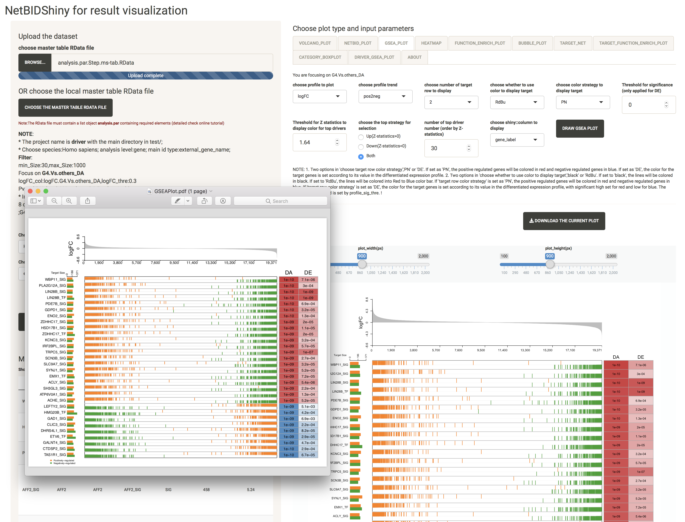

### HEATMAP: provides the expression/activity pattern of the top drivers across all samples

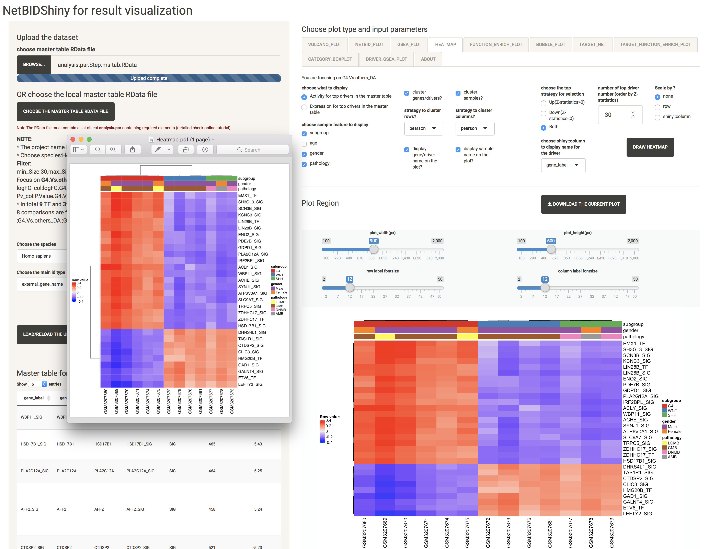

### FUNCTION_ENRICH_PLOT: provides the functional annotation for the top drivers

This uses the annotation from the MSigDB database. The user can choose multiple categories of gene sets and related statistics for the calculation. As long as the main category is selected, all of the gene sets from that category will be used, regardless of the sub-category selected. For example, if the user chooses the 'C5:GO' main category, all 'BP', 'MF', 'CC' will be used. 

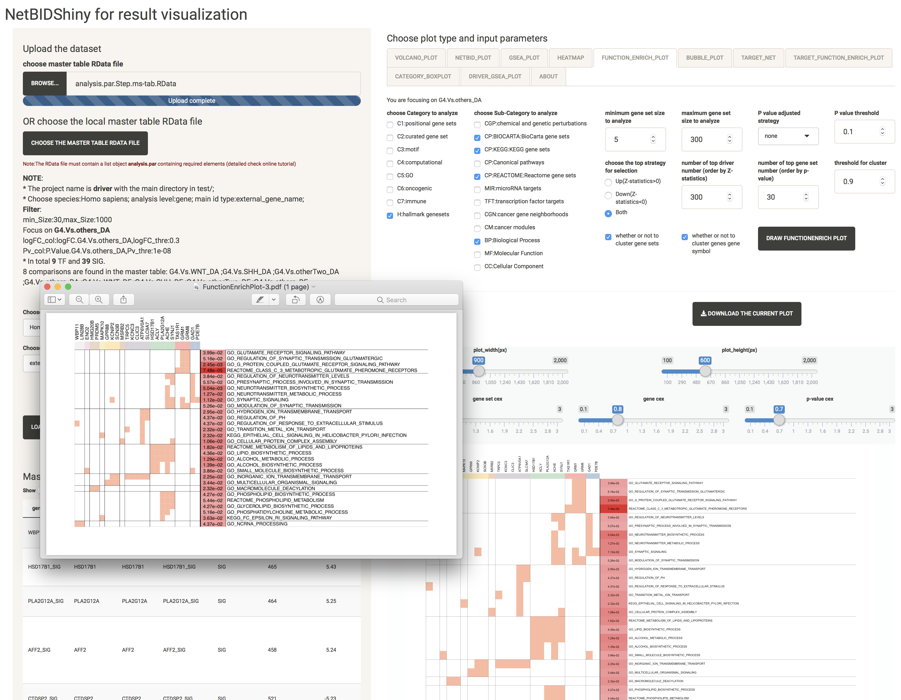

### BUBBLE_PLOT: provides the functional annotation for the top drivers and their target genes

This uses the annotation from the MSigDB database. The plot creation will take some time (several seconds). The figure can be very large and inconvenient to view. We recommend downloading it as a PDF.

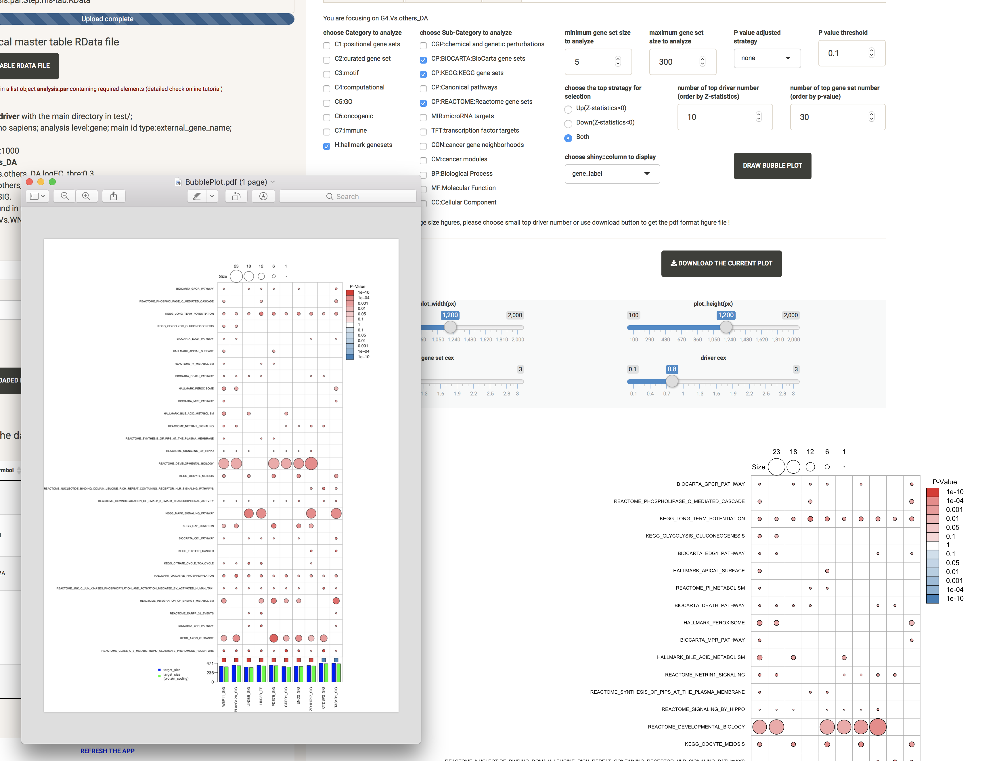

### TARGET_NET: shows the sub-network structure of a selected driver

For a better visualization of this highly overlapping network structure, we offer the option to adjust the text size `cex` and the `number of layers`.

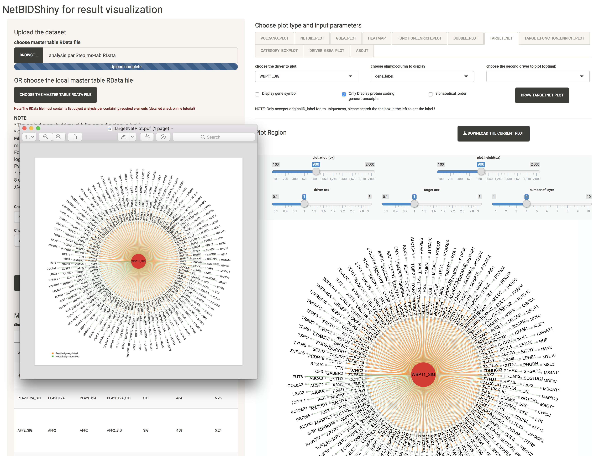

If the user adds one more driver of interest, the software will draw a shared sub-network with overlapping target genes in the middle.

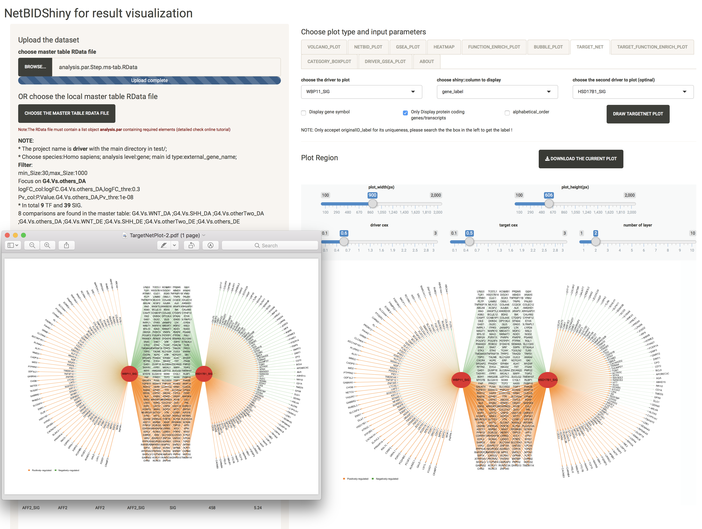

### TARGET_FUNCTION_ENRICH_PLOT: provides the functional annotation for the target genes of the driver

The user can choose which target genes of the driver to use for gene set enrichment analysis and visualization.

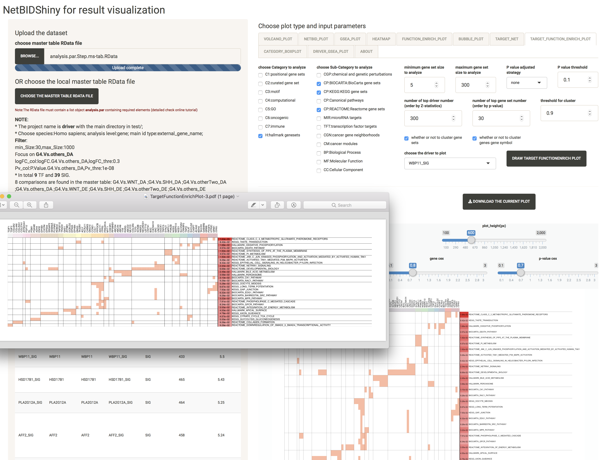


### CATEGORY_BOXPLOT: provides the distribution of the expression/activity values of a driver across the group of samples

The user can choose which phenotype feature to display.

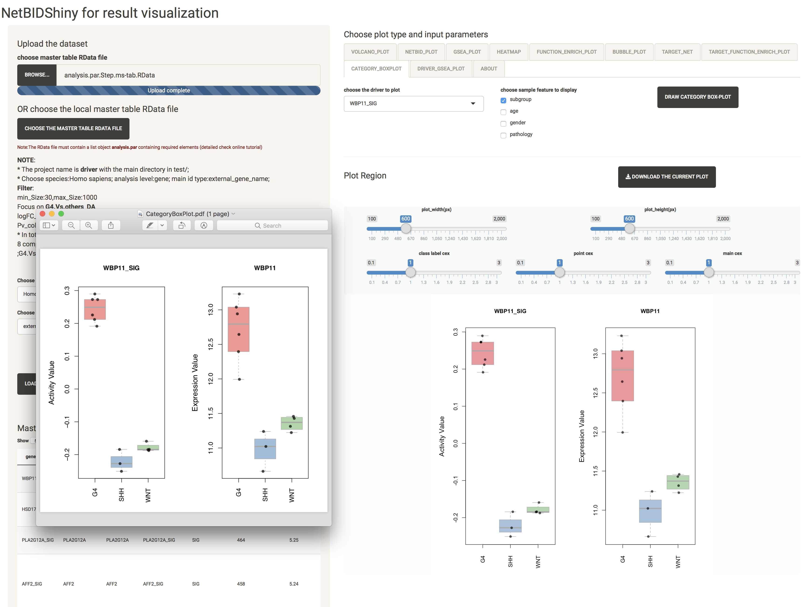

### DRIVER_GSEA_PLOT: provides the GSEA plot for a driver

The user can choose a driver for which to draw the GSEA plot.

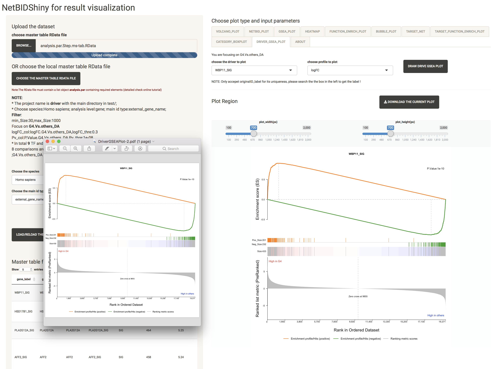


## Q & A: How do I share results with others by deploying the application by having a pre-generated result RData dataset ?

Option I: The user can call the function for deploying the shiny application.There are two options for running `NetBIDshiny.viewer()`:

-- **load_data_path**, the path for the master table Rdata file in the app server. If set, the RData file will be automatically loaded when the server is opened. 

```r
NetBIDshiny.viewer(load_data_path = system.file('demo1','driver/DATA/analysis.par.Step.ms-tab.RData',package = "NetBID2"))
```

-- **search_path**, the path for the master table Rdata searching in the app server. The user can choose from: 'Current Directory','Home','R Installation','Available Volumes', and can input a user-defined server path (it is better to use the absolute path). The default is c('Current Directory','Home'). If set to NULL, only the 'Current Directory' will be used. Input the directory as an option to run the application:

```r
NetBIDshiny.viewer(search_path='data/project_RData/')
```

Option II: The user can copy the `server.R` and `ui.R` from the `inst/app_viewer/` directory in the NetBIDshiny R package. Modify the code for the path settings from line 22 in `server.R` and organize the directories as follows (below is the screenshot of the data directory for our online version): 

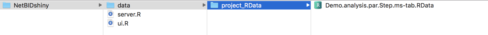

Then, the user can deploy the servers by using RStudio `Publish Application` tools. 

-------

